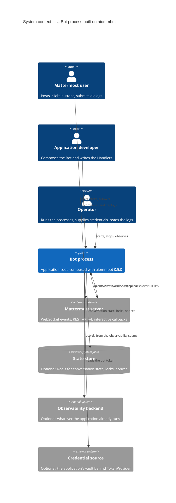

# 3. Context and scope

_Status: reviewed (#38)._

`aiommbot` is a library, so the system this catalogue designs is never deployed on its own: what
runs is a **Bot** process an application composes. This section draws the boundary around that
process — who talks to it, what it talks to, and which side of the line the framework is on.
[§5](05-building-block-view.md) opens the process; [§7](07-deployment-view.md) maps it onto
infrastructure.

## 3.1 Business context

| Partner | Direction | What they exchange, and why |
|---|---|---|
| Mattermost user | ↔ Bot | Writes posts and direct messages, clicks the buttons of an interactive attachment, submits a dialog. Receives answers, thread replies, post updates, ephemeral notices and dialogs. Never addresses the bot outside Mattermost. |
| Application developer | → Bot | Composes the Bot — one Adapter, a list of Plugins, a tree of Routers — and writes the Handlers, Providers and services that hold the business logic. Owns everything the framework refuses (ADR-0002). |
| Operator | ↔ Bot process | Starts the processes, supplies the token and the backend addresses, reads the structured logs and whatever the observability seams are wired to, and stops the process within its drain budget. |
| Mattermost administrator | → Mattermost | Creates the bot account and its personal access token, enables interactive dialogs, and is the only party who can revoke a bot's access — deleting or disabling the token, disabling the bot or deactivating the user (`docs/research/15`). |

## 3.2 Technical context

Every interface the framework itself owns, with the decision that fixes it. Nothing else crosses
the boundary: the framework opens no listening socket and reaches no host the application did not
configure.

| Interface | Protocol and direction | Owned by | Decision |
|---|---|---|---|
| Event stream | WebSocket to `/api/v4/websocket`, inbound, Bearer on the handshake, JSON `ping` every 30 s | WebSocketTransport | [ADR-0023](../adr/0023-websocket-gateway-resilience.md) |
| REST API | HTTPS to `/api/v4`, outbound, `Authorization: Bearer` | API client over `HTTPTransport` | [ADR-0026](../adr/0026-standalone-typed-api-client-over-an-http-transport-protocol.md) |
| Interactive callbacks | HTTPS POST, inbound, one attempt, no retry, no server signature, 30 s shared with `trigger_id` | Webhook, as a bare ASGI callable a host runs | [ADR-0024](../adr/0024-webhook-ingress-and-callback-security.md) |
| Callback authenticity | A self-issued token the bot puts in button `context` and dialog `state` and verifies on return | Callback token behind `CallbackTokenCodec` | [ADR-0024](../adr/0024-webhook-ingress-and-callback-security.md) |
| Conversation state, locks, nonces | Whatever the chosen backend speaks; in-memory and Redis are first-party | `KeyValueStore`, `LockProvider` | [ADR-0022](../adr/0022-state-plugin-model.md) |
| Credentials | Read through `TokenProvider` on every connection; never logged, never in a URL | Adapter | [ADR-0023](../adr/0023-websocket-gateway-resilience.md) |
| Observability | Typed records pushed to whatever the application registered; no observer by default | `RequestObserver`, Signals, the ErrorBoundary hook | [ADR-0026](../adr/0026-standalone-typed-api-client-over-an-http-transport-protocol.md), [ADR-0021](../adr/0021-core-error-boundary.md) |
| Process lifecycle | `run(*, loop_factory=None)` blocks; `serve()` embeds in a loop the application owns | Bot | [ADR-0031](../adr/0031-stdlib-asyncio-with-a-fixed-concurrency-discipline.md) |

Two properties of the Mattermost side shape more of this design than any other fact, and both are
counter-intuitive enough to restate here rather than leave in the research: **every WebSocket
connection of a bot account receives every event**, so a second identical replica processes each
message twice (`docs/research/01`, [ADR-0005](../adr/0005-one-ingress-many-workers.md)); and **the
server never closes a socket whose session was revoked and sends no event about it**, answering
every JSON request with `not_authenticated` instead (`docs/research/15`,
[ADR-0023](../adr/0023-websocket-gateway-resilience.md)).

## 3.3 Scope: the line between the framework and the application

The boundary above is drawn around the process. This table draws it *inside* the process, which is
the line the rest of the catalogue is about.

| Concern | aiommbot supplies | The application supplies |
|---|---|---|
| Receiving events | The transports, the envelope, decoding, backpressure, reconnection | Nothing |
| Deciding what runs | Routers, Filters, Extractors, the two middleware layers, dependency resolution | The tree, the subscriptions, the Providers |
| Acting on the platform | The API client, Workspace, Runtime, the error taxonomy | The calls it wants to make |
| Conversation state | `Flow`, `StateContext`, isolation, the two storage Protocols, in-memory and Redis backends | Which backend, and the Flows themselves |
| Configuration | Typed frozen settings objects per Plugin with stable field names | Where the values come from — environment, settings library, vault ([ADR-0015](../adr/0015-plugin-contract-and-composition.md)) |
| Running the process | `run()` and `serve()` | The event loop policy, the HTTP server, the process supervisor, the orchestrator ([ADR-0031](../adr/0031-stdlib-asyncio-with-a-fixed-concurrency-discipline.md), [ADR-0024](../adr/0024-webhook-ingress-and-callback-security.md)) |
| Failure handling | The ErrorBoundary: log without payload, report, return `Failed` | The user-facing apology, retries, dead-lettering, cooldowns ([ADR-0021](../adr/0021-core-error-boundary.md)) |
| Observability | Typed seams and a first-party extra | Its own conventions, names and backend ([ADR-0026](../adr/0026-standalone-typed-api-client-over-an-http-transport-protocol.md)) |
| Scheduling, retries, breakers, DLQ, CLI, metrics | Nothing — refused by the admission test | A library, a recipe or a plugin ([ADR-0002](../adr/0002-core-scope-two-condition-test.md)) |

Explicitly outside the whole catalogue: a second platform adapter, compatibility with the frozen
0.4.x line, migrating its consumer bots, and the implementation itself — that is the next map.
