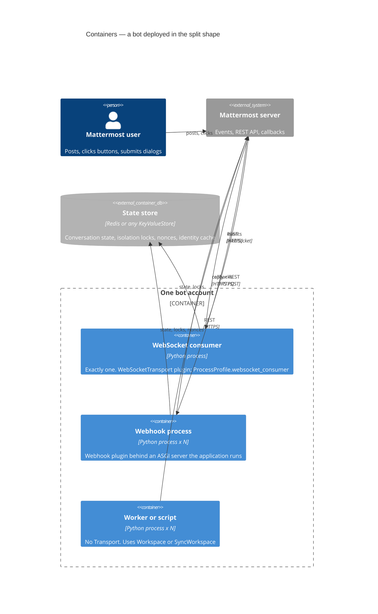
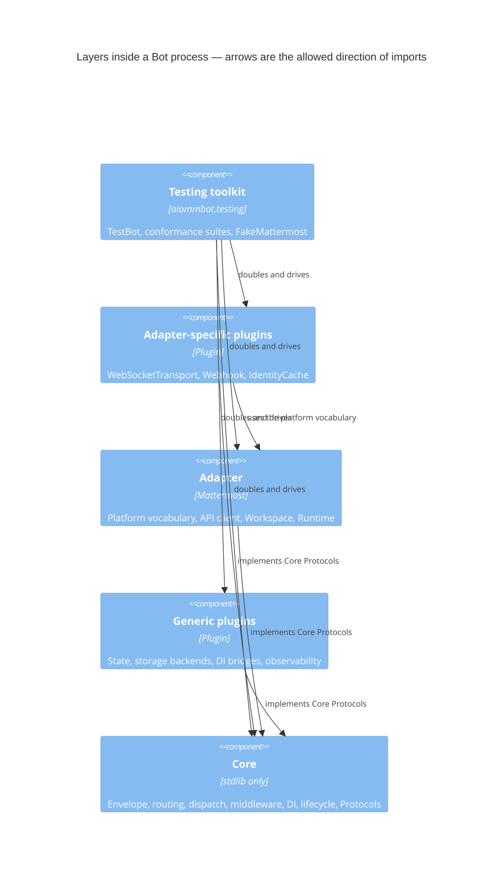
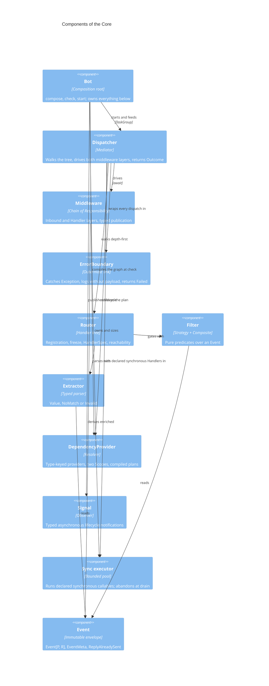
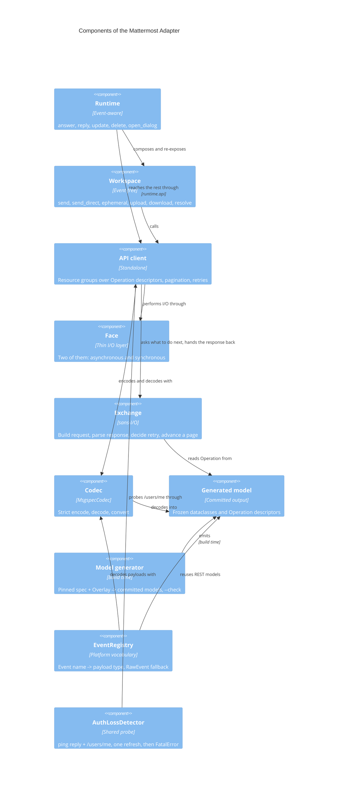
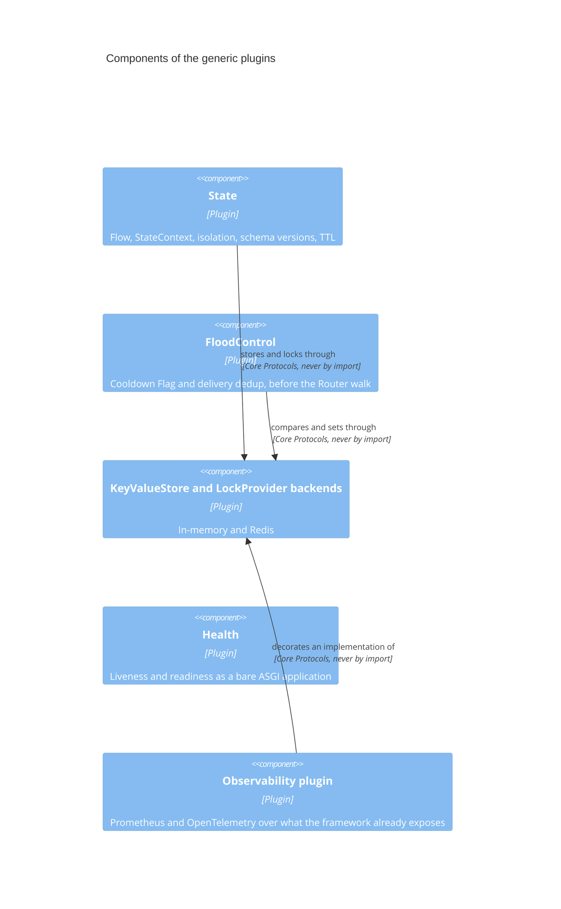
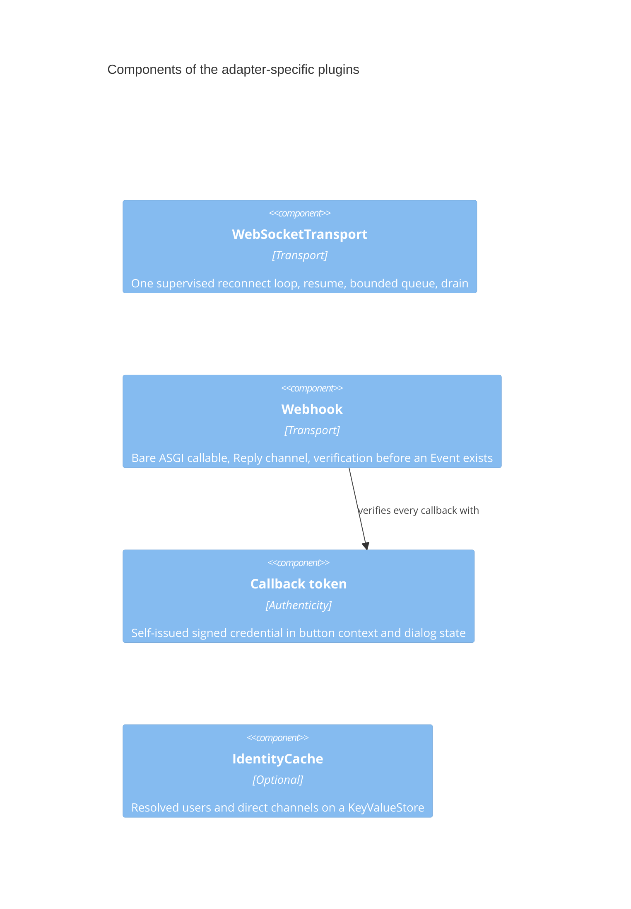
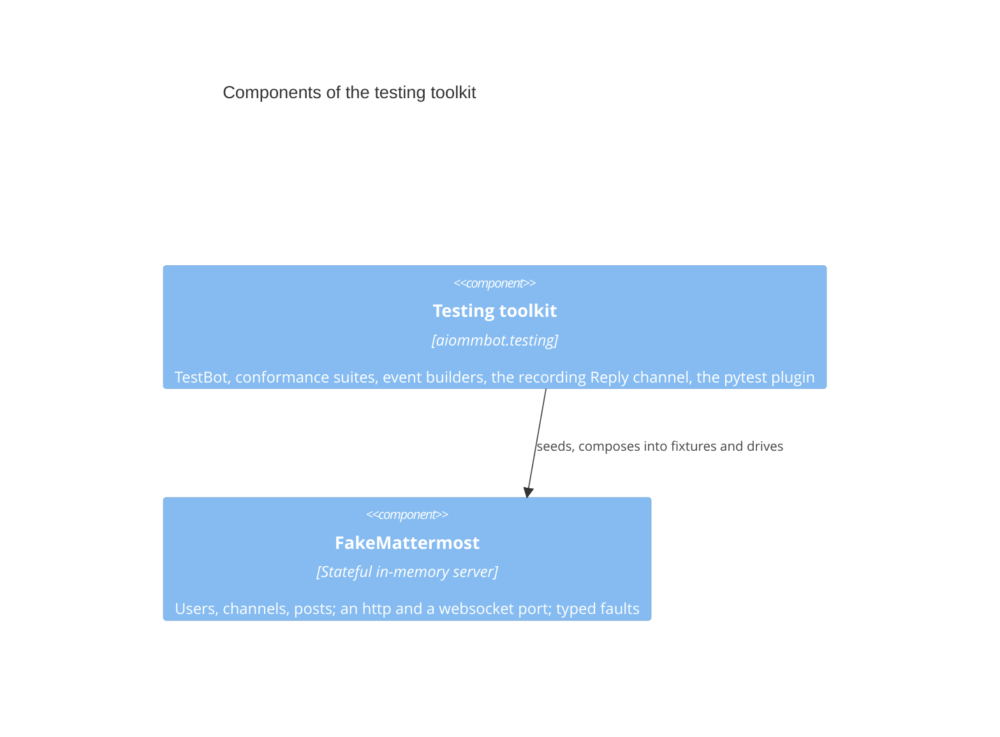

# 5. Building block view

_Status: reviewed (#38)._

The static decomposition, opened one level at a time. It is the **inventory** behind the
`LLD: <component>` tickets, and the direction of every arrow is the layer
contract of [ADR-0032](../adr/0032-layer-model-and-direction-of-allowed-dependencies.md), which
becomes the import-linter contract.

## 5.0 How to read this section

**Levels.** Level 1 is the Bot process as one box — that is [§3](03-context-and-scope.md).
Level 2 is the containers a deployment runs (5.2). Level 2 is opened once more into the five
**layers** inside a process (5.3). Level 3 is the components inside each layer, one diagram per
layer (5.5–5.9), because one diagram answers one question.

**Three ranks of block.** Every row of every inventory table is one of:

| Kind | Meaning | Gets a design document |
|---|---|---|
| **component** | A designable unit with its own contract, failure modes and pattern story | yes — `components/<term>.md` |
| **part** | A named piece that only makes sense inside one component | no — described inside that component's document |
| **seam** | A Protocol the Core owns that is neither a component nor a part of one, so implementations can be substituted; *required* or *provided* by the direction of the call (5.4) | no — described inside the document 5.4's *Specified in* column names, which is authoritative; listed in 5.4, with the two exceptions named under its table |

The distinction exists so that `RetryPolicy` and `NonceStore` are documented where they are used
instead of becoming two-page documents of their own, while `Workspace` and the two Faces — which
[ADR-0029](../adr/0029-synchronous-face-from-a-sans-io-core-with-thin-drivers.md) requires to be
designed — each get one.

**Diagram boxes and their documents.** The inventory table directly under each diagram carries the
link to every box's document, one row per box ([`diagrams.md`](diagrams.md)).

**Names.** Every block is named with its `CONTEXT.md` term, exactly.

## 5.1 Level 1 — the system

One box: the **Bot** process, an application's code composed with aiommbot. Its partners and its
interfaces are [§3](03-context-and-scope.md).

## 5.2 Level 2 — containers

The framework has no container of its own; what a deployment runs are processes composed from the
same `Bot` object, differing only in which Transports are in the plugin list and what the
`ProcessProfile` declares. Exactly one WebSocket consumer per bot account is the one hard
constraint ([ADR-0005](../adr/0005-one-ingress-many-workers.md)); the rest replicates.

| Container | Responsibility | Composition | Replicates |
|---|---|---|---|
| WebSocket consumer | Holds the one long-lived socket, decodes events, dispatches them | `WebSocketTransport` in the plugin list, `websocket_consumer=True` | no — a second replica is a standby behind a `LockProvider` lease |
| Webhook process | Serves interactive callbacks within the reply deadline | `Webhook` in the plugin list; the application's ASGI server hosts it | yes, behind a load balancer |
| Worker or script | Acts on Mattermost with no inbound events | no Transport at all; `Workspace` or `SyncWorkspace` | yes |

All three collapse into one process in the all-in-one shape; which shape to run, and the
Kubernetes consequences of the drain budget, are [§7](07-deployment-view.md).

## 5.3 Level 2 opened — the layers inside a process

Five layers, four import ranks: the two middle boxes are **one rank**, so a generic Plugin may not
import the Adapter, and every arrow points at the Core.
→ [ADR-0032](../adr/0032-layer-model-and-direction-of-allowed-dependencies.md),
[ADR-0015](../adr/0015-plugin-contract-and-composition.md),
[ADR-0002](../adr/0002-core-scope-two-condition-test.md)

The layer names and their direction are this section's line; each rank's package directory is
[ADR-0040](../adr/0040-one-package-directory-per-import-rank.md)'s, and a diagram that disagrees
with that tree is a bug in one of the two.

## 5.4 The seams of the Core

The Protocols the Core owns that are ranked `seam` — neither a component nor a part of one — with
the direction of the call through each, who implements it, and the document that specifies it.
Two directions, in the vocabulary UML gives them
([ADR-0038](../adr/0038-seam-inventory-records-the-direction-of-the-call.md)):

- **required** — the Core calls out through the Protocol and an outside party implements it. This is
  the single point of dependency inversion
  ([ADR-0006](../adr/0006-architectural-tenets-of-the-core.md) tenet 2), and twelve of the thirteen
  rows are of this kind.
- **provided** — the Core hands user code an object typed by the Protocol, and user code calls it.
  One row today, and the design expects no second.

A Core-owned Protocol that *is* a component or a part of one is not a row here: `Filter`,
`Extractor` and `Middleware` are components, `Provider` and `Check` are parts, and the IdentityCache
Protocol is the Adapter's rather than the Core's (5.8). The *Specified in* column is **authoritative**
about where a contract lives — it is not always the consumer's document, and for a provided seam the
consumer is user code and has no document
([ADR-0035](../adr/0035-lld-order-is-a-topological-sort-of-structural-contract-dependencies.md),
ADR-0038).

| Seam | Direction | Consumed by | Shipped implementations | Specified in | Decision |
|---|---|---|---|---|---|
| `Transport` | required | Dispatcher | WebSocketTransport, Webhook | `dispatcher.md` | [ADR-0015](../adr/0015-plugin-contract-and-composition.md) |
| `DependencyProvider` | required | Bot | the Core's own resolver; dishka and wireup bridges | `dependency-provider.md` | [ADR-0018](../adr/0018-core-owned-type-keyed-dependency-injection.md) |
| `Clock` | required | Bot, WebSocketTransport, Webhook, State, FloodControl, Health, API client | the Core's own over the standard library; `FakeClock` | `bot.md` | [ADR-0059](../adr/0059-clock-is-the-thirteenth-seam-of-the-core.md) |
| `KeyValueStore` | required | State, Webhook, IdentityCache, FloodControl | in-memory, Redis | `key-value-store.md` | [ADR-0022](../adr/0022-state-plugin-model.md) |
| `LockProvider` | required | State, WebSocketTransport | in-memory, Redis | `key-value-store.md` | [ADR-0022](../adr/0022-state-plugin-model.md) |
| `Codec` | required | API client, Transports, State | `MsgspecCodec` | `codec.md` | [ADR-0025](../adr/0025-generated-dataclass-models-with-a-codec-protocol.md) |
| `HTTPTransport`, `SyncHTTPTransport` | required | Face | httpx2; the in-memory double implements both in one class | `face.md` | [ADR-0026](../adr/0026-standalone-typed-api-client-over-an-http-transport-protocol.md), [ADR-0029](../adr/0029-synchronous-face-from-a-sans-io-core-with-thin-drivers.md) |
| `WebSocketConnection` | required | WebSocketTransport | `websockets` primary, `picows` extra, the in-memory double | `websocket-transport.md` | [ADR-0023](../adr/0023-websocket-gateway-resilience.md) |
| `StateKeyProvider` | required | State, FloodControl | the Adapter's | `state.md` | [ADR-0022](../adr/0022-state-plugin-model.md) |
| `TokenProvider`, `SyncTokenProvider` | required | WebSocketTransport, API client, Face | none — the application's | `face.md` | [ADR-0023](../adr/0023-websocket-gateway-resilience.md), [ADR-0029](../adr/0029-synchronous-face-from-a-sans-io-core-with-thin-drivers.md) |
| `CallbackTokenCodec` | required | Webhook | stdlib HMAC-SHA256; `pyseto` PASETO extra | `callback-token.md` | [ADR-0024](../adr/0024-webhook-ingress-and-callback-security.md) |
| `RequestObserver`, `SyncRequestObserver` | required | API client | none by default; the Observability plugin | `api-client.md` | [ADR-0026](../adr/0026-standalone-typed-api-client-over-an-http-transport-protocol.md), [ADR-0048](../adr/0048-observability-is-not-a-core-seam.md) |
| `ReplyChannel` | **provided** | the Handler — user code, not a component | Webhook, as `ReplyChannel[ActionReply]` and `ReplyChannel[DialogReply]`; the testing toolkit's recording slot | `event.md` | [ADR-0036](../adr/0036-reply-slot-as-a-second-type-parameter-over-a-core-owned-reply-channel.md), [ADR-0038](../adr/0038-seam-inventory-records-the-direction-of-the-call.md) |

The seven `Contributes*`/`HasLifecycle` Protocols are not rows here: they are the plugin contract of
[ADR-0015](../adr/0015-plugin-contract-and-composition.md) rather than substitution points, and
their rank is #85's. There is no observability row beyond the one above — a dispatch fact is the
typed `Outcome`, observed by Middleware
([ADR-0048](../adr/0048-observability-is-not-a-core-seam.md)).

## 5.5 Level 3 — the Core

| Block | Kind | Responsibility | Document | Decisions |
|---|---|---|---|---|
| **Bot** | component | Composition root: gathers plugin contributions, orders them topologically, runs the three-phase compose → check → start, owns the lifecycle and the entry points | `bot.md` | [ADR-0015](../adr/0015-plugin-contract-and-composition.md), [ADR-0016](../adr/0016-three-phase-start-with-checks.md), [ADR-0031](../adr/0031-stdlib-asyncio-with-a-fixed-concurrency-discipline.md) |
| `PluginSpec`, `Check`, `ProcessProfile`, `run()`/`serve()`, the `aiommbot` command, the standard-library `Clock` | part | The plugin declaration, the typed check objects, the process role, the two entry points, the console script that runs `check` and `run` behind the `click` extra, and the Core's own implementation of the `Clock` seam | `bot.md` | same, plus [ADR-0058](../adr/0058-the-command-is-a-console-script-behind-the-click-extra.md), [ADR-0059](../adr/0059-clock-is-the-thirteenth-seam-of-the-core.md) |
| **Dispatcher** | component | Receives every Event the Bot feeds it, drives Inbound then Handler middleware, walks the Router tree to the first match, resolves parameters, returns the typed `Outcome` to the Transport | `dispatcher.md` | [ADR-0013](../adr/0013-type-driven-routing-with-a-typed-dispatch-outcome.md), [ADR-0020](../adr/0020-two-layer-middleware-chain.md) |
| `Outcome`, `MatchedHandler`, `Skip` | part | The typed dispatch result, the Event-scoped publication after a match, the `Skip` exception that continues the walk | `dispatcher.md` | same |
| **Router** | component | The handler tree: registration by annotation, adapter aliases, filter gates, freeze, `bot.routes()`, unreachable-handler check | `router.md` | [ADR-0013](../adr/0013-type-driven-routing-with-a-typed-dispatch-outcome.md) |
| `HandlerSpec`, `Flag` | part | The frozen record of a registration, and the typed objects that parametrise middleware from a subscription | `router.md` | [ADR-0013](../adr/0013-type-driven-routing-with-a-typed-dispatch-outcome.md), [ADR-0020](../adr/0020-two-layer-middleware-chain.md) |
| **Filter** | component | Pure predicates over an Event, composable with `&`, `\|`, `~`, renderable as data | `filter.md` | [ADR-0014](../adr/0014-filters-and-extractors-with-closed-handler-signatures.md) |
| **Extractor** | component | Typed parsing of an Event into a handler parameter, yielding `Value`, `NoMatch` or `Invalid` | `extractor.md` | [ADR-0014](../adr/0014-filters-and-extractors-with-closed-handler-signatures.md) |
| **Middleware** | component | The two named layers, the `__call__(event, call_next, *deps) -> Outcome` contract, typed Event-scope publication, topological ordering frozen as `bot.middleware()` | `middleware.md` | [ADR-0020](../adr/0020-two-layer-middleware-chain.md) |
| **ErrorBoundary** | component | The non-removable outermost link: catch `Exception`, log without payload, report, return `Failed`; let `BaseException` and `FatalError` through | `error-boundary.md` | [ADR-0021](../adr/0021-core-error-boundary.md) |
| `AiommbotError`, `FatalError`, `AiommbotWarning` | part | The roots of the exception hierarchy and the public warning class | `error-boundary.md` | [ADR-0021](../adr/0021-core-error-boundary.md), [ADR-0027](../adr/0027-api-error-taxonomy.md), [ADR-0030](../adr/0030-synchronous-callables-by-explicit-declaration.md) |
| **DependencyProvider** | component | The Core's small type-keyed resolver behind the Protocol of the same name: providers, two Scopes, graph validation and per-handler resolution plans compiled at check time | `dependency-provider.md` | [ADR-0018](../adr/0018-core-owned-type-keyed-dependency-injection.md), [ADR-0019](../adr/0019-handler-parameter-resolution-rules.md) |
| `Provider`, `Qualifier`, `Scope`, `Resolution plan`, the built-in set, dishka and wireup bridges | part | The declaration, the homonym marker, the two lifetimes, the compiled plan, what the Core injects, and the two bridge plugins | `dependency-provider.md` | same |
| **Signal** | component | `Signal[T]`: typed asynchronous lifecycle notification, every subscriber runs, failures collected not swallowed | `signal.md` | [ADR-0017](../adr/0017-typed-async-lifecycle-signals.md) |
| **Sync executor** | component | The Bot's own bounded thread pool: colour resolution at registration, `sync_to_thread` warnings, `contextvars` copying, dropping the wait at drain with `HandlerAbandoned` | `sync-executor.md` | [ADR-0030](../adr/0030-synchronous-callables-by-explicit-declaration.md) |
| **Event** | component | The immutable generic envelope and its metadata; the only Core type every other block reads | `event.md` | [ADR-0012](../adr/0012-generic-event-envelope-with-adapter-payloads.md) |
| `EventMeta`, `CorrelationId`, `ReplyAlreadySent` | part | Transport, receive time, correlation, sequence, raw data, the optional typed Reply slot, and the fieldless marker `send` returns once the slot is claimed | `event.md` | [ADR-0012](../adr/0012-generic-event-envelope-with-adapter-payloads.md), [ADR-0024](../adr/0024-webhook-ingress-and-callback-security.md), [ADR-0036](../adr/0036-reply-slot-as-a-second-type-parameter-over-a-core-owned-reply-channel.md) |

## 5.6 Level 3 — the Mattermost Adapter

| Block | Kind | Responsibility | Document | Decisions |
|---|---|---|---|---|
| **EventRegistry** | component | The platform vocabulary: event name → payload type, explicit registration, duplicate-name check, and the wire quirks handled once at decode | `event-registry.md` | [ADR-0012](../adr/0012-generic-event-envelope-with-adapter-payloads.md) |
| The 15 first-class payloads, `RawEvent` | part | The typed payloads of 0.5.0 and the fallback that keeps every other name routable | `event-registry.md` | [ADR-0012](../adr/0012-generic-event-envelope-with-adapter-payloads.md); full catalogue is #45 |
| Platform filters and router aliases | part | `ChatType`, `Text`, `@router.message`/`action`/`dialog` reducing to `@router.on` | `filter.md`, `router.md` | [ADR-0013](../adr/0013-type-driven-routing-with-a-typed-dispatch-outcome.md), [ADR-0014](../adr/0014-filters-and-extractors-with-closed-handler-signatures.md) |
| `StateKeyProvider` implementation | part | Builds a `StateKey` from an Event according to the strategy the State plugin is configured with | `state.md` | [ADR-0022](../adr/0022-state-plugin-model.md) |
| **Model generator** | component | Build time only: applies the OpenAPI Overlay to the ESR-pinned spec, emits models and `Operation` descriptors for both Faces idempotently, fails the build on a hand edit, watches upstream drift nightly | `model-generator.md` | [ADR-0025](../adr/0025-generated-dataclass-models-with-a-codec-protocol.md) |
| **Generated model** | component | The committed frozen dataclasses and the `Operation` descriptors: the optionality rules, `UNSET` on requests, the hand-written models for what the spec leaves as `object` | `generated-model.md` | [ADR-0025](../adr/0025-generated-dataclass-models-with-a-codec-protocol.md) |
| `Operation` | part | The frozen descriptor of one REST call, public and user-constructible for endpoints outside the spec | `generated-model.md` | [ADR-0026](../adr/0026-standalone-typed-api-client-over-an-http-transport-protocol.md) |
| **Codec** | component | `MsgspecCodec`, the only shipped implementation of the Core seam, registered as an App-scoped provider; the `dec_hook` that unpacks Mattermost's JSON-in-JSON | `codec.md` | [ADR-0025](../adr/0025-generated-dataclass-models-with-a-codec-protocol.md) |
| **API client** | component | The standalone `MattermostClient`: resource groups by spec tag, `execute` as the typed escape hatch, pagination iterators, and the observer pair that is the Core's observability seam | `api-client.md` | [ADR-0026](../adr/0026-standalone-typed-api-client-over-an-http-transport-protocol.md), [ADR-0048](../adr/0048-observability-is-not-a-core-seam.md) |
| `RetryPolicy`, `ApiError` and its subclasses, `iter_*`, the Request record | part | The narrow retry setting, the failure hierarchy with `retryable`, the pagination iterators, and the frozen per-attempt record the observer pair receives | `api-client.md` | [ADR-0026](../adr/0026-standalone-typed-api-client-over-an-http-transport-protocol.md), [ADR-0027](../adr/0027-api-error-taxonomy.md), [ADR-0048](../adr/0048-observability-is-not-a-core-seam.md) |
| **Exchange** | component | The sans-I/O heart shared by both Faces: build the request from an `Operation`, classify the response, decide the retry, advance a page — pure functions, tested once without a network | `exchange.md` | [ADR-0029](../adr/0029-synchronous-face-from-a-sans-io-core-with-thin-drivers.md) |
| **Face** | component | The two thin I/O layers over the Exchange — asynchronous and synchronous — and the parity mechanisms that keep them in step | `face.md` | [ADR-0029](../adr/0029-synchronous-face-from-a-sans-io-core-with-thin-drivers.md) |
| The httpx2 binding of `HTTPTransport`/`SyncHTTPTransport`, `TokenProvider`/`SyncTokenProvider` use, the one-instance-per-thread contract | part | The shipped transport implementation, how credentials are read on each face, and the threading promise the synchronous face does *not* make | `face.md` | [ADR-0026](../adr/0026-standalone-typed-api-client-over-an-http-transport-protocol.md), [ADR-0029](../adr/0029-synchronous-face-from-a-sans-io-core-with-thin-drivers.md) |
| **Workspace** | component | The Event-free handle on one server — `send`, `send_direct`, `ephemeral`, `upload`, `download`, `users.resolve`, `channels.direct` — independently constructible, and the only helper layer with a synchronous face | `workspace.md` | [ADR-0028](../adr/0028-runtime-helpers-and-identity-resolution.md), [ADR-0029](../adr/0029-synchronous-face-from-a-sans-io-core-with-thin-drivers.md) |
| `UserRef` resolution | part | The typed union resolved in priority order, with ambiguity and absence as typed outcomes | `workspace.md` | [ADR-0028](../adr/0028-runtime-helpers-and-identity-resolution.md) |
| **Runtime** | component | The Event-bound layer a Handler receives: `answer`, `reply`, `update`, `delete`, `open_dialog`, taking channel, `root_id` and `trigger_id` from the Event; composes a Workspace and exposes `runtime.api` | `runtime.md` | [ADR-0028](../adr/0028-runtime-helpers-and-identity-resolution.md), [ADR-0029](../adr/0029-synchronous-face-from-a-sans-io-core-with-thin-drivers.md) |
| **AuthLossDetector** | component | Turns a mute socket into a decision: parse every `ping` reply, probe `/users/me`, refresh once, then `FatalError(AuthRevoked)` carrying ids and never the token. Shared by the WebSocketTransport and the API client | `auth-loss-detector.md` | [ADR-0023](../adr/0023-websocket-gateway-resilience.md), [ADR-0027](../adr/0027-api-error-taxonomy.md) |

## 5.7 Level 3 — generic plugins

Bound to the Core only. They may not import the Adapter
([ADR-0032](../adr/0032-layer-model-and-direction-of-allowed-dependencies.md)).

State reaches the backends the way every plugin reaches every other capability — through the Core
Protocol, never by importing the plugin that also implements it.

State is the case that proves the rank of
[ADR-0032](../adr/0032-layer-model-and-direction-of-allowed-dependencies.md): it consumes the Core
`StateKeyProvider` seam and receives the Adapter's implementation by injection. FloodControl is the
same case twice over — it reaches a chat identity through that seam and a platform delivery id
through a callable its settings receive, never by importing the Adapter
([ADR-0060](../adr/0060-flood-control-and-delivery-dedup-are-one-generic-plugin.md)). The
Observability plugin is the third case, and the reason `bot.stats()` exists: it needs the
WebSocketTransport's queue depth and may not import an adapter-specific plugin, so it reads the
Bot's aggregate instead
([ADR-0050](../adr/0050-bounded-resource-state-is-read-not-pushed.md)).

| Block | Kind | Responsibility | Document | Decisions |
|---|---|---|---|---|
| **State** | component | Conversation state: `Flow[Data]`, `StateContext`, the `InState` filter, per-key isolation as Inbound middleware, compare-and-set writes, schema versions, the sliding logical TTL | `state.md` | [ADR-0003](../adr/0003-stateless-core-state-plugin-with-explicit-backend.md), [ADR-0022](../adr/0022-state-plugin-model.md) |
| `StateKey`, `Flow`, `StateContext`, the isolation middleware, `Conflict`, `StaleState` | part | The key and its strategy, the typed flow and its versioned data, the handle a handler receives, and the two typed failure outcomes | `state.md` | [ADR-0022](../adr/0022-state-plugin-model.md) |
| **FloodControl** | component | Admitting an Event to the Router walk or declining it: the `Cooldown` Flag and its Inbound middleware over a compare-and-set, the delivery-dedup middleware the platform identity feeds, the declared order between them, the fail-open rule and the Checks on the backend | `flood-control.md` | [ADR-0060](../adr/0060-flood-control-and-delivery-dedup-are-one-generic-plugin.md) |
| `Cooldown`, `Suppression`, the platform-identity callable | part | The Flag a Handler carries, the Event-scope value published when an Event is declined, and the typed setting through which a generic plugin learns a platform delivery id | `flood-control.md` | [ADR-0060](../adr/0060-flood-control-and-delivery-dedup-are-one-generic-plugin.md) |
| **KeyValueStore** and **LockProvider** backends | component | The two first-party implementations of both storage seams — in-memory for a declared single process, Redis for TTL and distributed locks — plus the conformance suite external backends must pass | `key-value-store.md` | [ADR-0022](../adr/0022-state-plugin-model.md) |
| dishka and wireup bridges | part | Serving dependencies from an external container behind `DependencyProvider`, shipped as extras | `dependency-provider.md` | [ADR-0018](../adr/0018-core-owned-type-keyed-dependency-injection.md) |
| **Health** | component | The two probe paths as a bare ASGI callable: liveness that runs no check and survives the drain, readiness as the conjunction of the Bot's phase, the Transports' Signals and the application's own checks, run concurrently under per-check timeouts with a cached aggregate and an always-empty body | `health.md` | [ADR-0061](../adr/0061-health-is-a-generic-plugin-over-application-supplied-checks.md) |
| `health_app(bot)`, `HealthPaths`, `ReadinessCheck` | part | The ASGI callable the application hosts, the two configurable paths, and the frozen named check with its own timeout that the settings receive | `health.md` | [ADR-0061](../adr/0061-health-is-a-generic-plugin-over-application-supplied-checks.md) |
| **Observability plugin** | component | `PrometheusPlugin` and `OpenTelemetryPlugin`, each behind the extra named after its library: two Middleware over the dispatch layers, an implementation of the `RequestObserver` pair, subscribers to the Signals, `ObservedKeyValueStore` and `ObservedLockProvider`, a collector reading the Stats snapshot, and an `HTTPTransport` decorator injecting `traceparent`. Takes its registry as an argument and touches no process-global state | `observability.md` | [ADR-0049](../adr/0049-what-the-framework-makes-observable.md), [ADR-0050](../adr/0050-bounded-resource-state-is-read-not-pushed.md), [ADR-0051](../adr/0051-first-party-observability-plugin.md) |

## 5.8 Level 3 — adapter-specific plugins

Bound to the Mattermost Adapter; each implements the Core `Transport` seam or extends the Adapter.

The two Transports never touch: an `independence` contract keeps them apart, and the one thing
Webhook's nonce store and IdentityCache have in common is the Core `KeyValueStore` seam.

| Block | Kind | Responsibility | Document | Decisions |
|---|---|---|---|---|
| **WebSocketTransport** | component | One reconnect loop with a `TaskGroup` per connection, the transient/resumable/fatal exit table, heartbeat and silence monitor, full-jitter backoff, resume with sequence continuity, a reader that never stalls, the graceful drain, the single-consumer declaration and optional lease | `websocket-transport.md` | [ADR-0023](../adr/0023-websocket-gateway-resilience.md), [ADR-0030](../adr/0030-synchronous-callables-by-explicit-declaration.md) |
| The bounded queue and `OverflowPolicy`, the dedup of `(connection_id, seq)`, the drain, the `websockets`/`picows` bindings, the Transport's Signals | part | Backpressure with a typed per-kind policy, replay dedup, the 25 s drain, the two `WebSocketConnection` implementations, and `Connected`…`DrainTimedOut` | `websocket-transport.md` | [ADR-0023](../adr/0023-websocket-gateway-resilience.md) |
| Resync backfill | part | Recovering the loss window a `Resynced(since)` Signal reports; first-party plugin or documented recipe is #55's decision | deferred to #55 | [ADR-0023](../adr/0023-websocket-gateway-resilience.md) |
| **Webhook** | component | `webhook_app(bot) -> ASGIApp` and `handle_callback`, the payload-bound single-use Reply channel with its 10 s deadline and empty-200 default, verification before an Event exists, the 1 MiB reply cap, the logging rules | `webhook.md` | [ADR-0024](../adr/0024-webhook-ingress-and-callback-security.md) |
| The reply values `ActionReply` and `DialogReply` with the deadline behaviour, `StaleAction` | part | The two `ReplyChannel` implementations bound to the payload — `ReplyAlreadySent` is the Core's — and the routable event an expired or replayed token produces | `webhook.md` | [ADR-0024](../adr/0024-webhook-ingress-and-callback-security.md), [ADR-0036](../adr/0036-reply-slot-as-a-second-type-parameter-over-a-core-owned-reply-channel.md) |
| **Callback token** | component | The self-issued credential: the compact HMAC-SHA256 format, the claim set, key rotation by `kid`, the typed verification union, and the default-on policy with its explicit `off` | `callback-token.md` | [ADR-0024](../adr/0024-webhook-ingress-and-callback-security.md) |
| `NonceStore`, the PASETO extra | part | Opt-in single-use enforcement on a `KeyValueStore`, and `pyseto` behind the same `CallbackTokenCodec` | `callback-token.md` | [ADR-0024](../adr/0024-webhook-ingress-and-callback-security.md) |
| **IdentityCache** | component | Optional caching of resolved users and direct channels on a `KeyValueStore` with a one-hour TTL and event-driven invalidation; absent, the Workspace queries every time. The Workspace consults it through an **Adapter-owned Protocol**, so the import still points plugin → Adapter and never back | `identity-cache.md` | [ADR-0028](../adr/0028-runtime-helpers-and-identity-resolution.md), [ADR-0032](../adr/0032-layer-model-and-direction-of-allowed-dependencies.md) |

## 5.9 Level 3 — the testing toolkit

`aiommbot.testing` may import every layer and is imported by none
([ADR-0032](../adr/0032-layer-model-and-direction-of-allowed-dependencies.md)). It is the one public
package that imports pytest, delivered by the extra of the same name, and its fixtures reach a test
session only when the application asks for them by name
([ADR-0044](../adr/0044-the-testing-toolkit-requires-pytest-and-is-activated-explicitly.md)).

Two components, because the platform double holds state, has invariants and fails in ways of its
own, while everything else in the layer is a helper over somebody else's contract
([ADR-0045](../adr/0045-one-stateful-fake-mattermost-is-the-only-platform-double.md)).

A test configures exactly one object of the platform — the server — and reaches every seam it
implements through that object's ports; there is no second double of Mattermost anywhere
(ADR-0045).

| Block | Kind | Responsibility | Document | Decisions |
|---|---|---|---|---|
| **Testing toolkit** | component | Everything a test needs that is not the platform: the wrapper that runs a composed Bot, the fourteen conformance suites, the typed event builders, the recording Reply channel, the two small doubles, the routing assertion and the pytest plugin | `testing-toolkit.md` | [ADR-0044](../adr/0044-the-testing-toolkit-requires-pytest-and-is-activated-explicitly.md), [ADR-0046](../adr/0046-testbot-wraps-the-composed-bot.md), [ADR-0047](../adr/0047-a-conformance-suite-per-core-seam.md) |
| `TestBot` | part | The wrapper over a composed Bot: typed overrides by key before the start, an asynchronous context manager running check and start with no Transport, `feed` returning the typed `Outcome`, and typed records of outcomes, replies and Signals | `testing-toolkit.md` | [ADR-0019](../adr/0019-handler-parameter-resolution-rules.md), [ADR-0046](../adr/0046-testbot-wraps-the-composed-bot.md) |
| The fourteen conformance suites | part | One factory per seam row of 5.4 plus the plugin lifecycle, each taking the implementer's factory and the capabilities it declines, and reporting a named case's expectation and observation as typed data | `testing-toolkit.md` | [ADR-0047](../adr/0047-a-conformance-suite-per-core-seam.md) |
| Event builders | part | One typed constructor per first-class payload, filling `EventMeta` and validating what the envelope deliberately does not; the server produces its events through the same builders | `testing-toolkit.md` | [ADR-0012](../adr/0012-generic-event-envelope-with-adapter-payloads.md), [ADR-0045](../adr/0045-one-stateful-fake-mattermost-is-the-only-platform-double.md) |
| Recording `ReplyChannel` slot | part | The second implementation of the one provided seam, generic in `R`, over which the `ReplyChannel` suite is parametrised alongside the Webhook's two slots | `testing-toolkit.md` | [ADR-0036](../adr/0036-reply-slot-as-a-second-type-parameter-over-a-core-owned-reply-channel.md) |
| `FakeAdapter` and `FakeClock` | part | The Adapter double a Core-only test composes, and the second shipped implementation of the `Clock` seam, by which every timeout, TTL and backoff is driven instead of sleeping (`ST-TST-09`) | `testing-toolkit.md` | [ADR-0022](../adr/0022-state-plugin-model.md), [ADR-0046](../adr/0046-testbot-wraps-the-composed-bot.md), [ADR-0059](../adr/0059-clock-is-the-thirteenth-seam-of-the-core.md) |
| `assert_matches(event, handler)` | part | Shadowing between arbitrary filters, which start-up cannot decide | `testing-toolkit.md` | [ADR-0013](../adr/0013-type-driven-routing-with-a-typed-dispatch-outcome.md) |
| The typed name-parity test of the two Faces | part | Holding duality by mechanism rather than review | `testing-toolkit.md` | [ADR-0029](../adr/0029-synchronous-face-from-a-sans-io-core-with-thin-drivers.md) |
| The pytest plugin and its three fixtures | part | `fake_mattermost`, `test_bot` and `fake_clock`, named in `pytest_plugins`, adding no option, marker or hook | `testing-toolkit.md` | [ADR-0044](../adr/0044-the-testing-toolkit-requires-pytest-and-is-activated-explicitly.md) |
| **FakeMattermost** | component | The stateful in-memory server: users, channels, posts and reactions, answered with the generated models through the `Codec` seam, and a socket whose resume and sequence behaviour follows the protocol | `fake-mattermost.md` | [ADR-0045](../adr/0045-one-stateful-fake-mattermost-is-the-only-platform-double.md), [`docs/research/01`](../research/01-mattermost-websocket-protocol.md) |
| The `http` and `websocket` ports | part | One class implementing both `HTTPTransport` and `SyncHTTPTransport`, and one implementing `WebSocketConnection`; each passes its own conformance suite | `fake-mattermost.md` | [ADR-0029](../adr/0029-synchronous-face-from-a-sans-io-core-with-thin-drivers.md), [ADR-0023](../adr/0023-websocket-gateway-resilience.md) |
| Typed fault injection | part | Scheduled outcomes on an `Operation` and on the socket — a status with an `AppError`, a close code, silence, a revoked session, a sequence gap — which is what removes the need for a scripted transport | `fake-mattermost.md` | [ADR-0027](../adr/0027-api-error-taxonomy.md), [ADR-0045](../adr/0045-one-stateful-fake-mattermost-is-the-only-platform-double.md) |
| Seeding, per-`Operation` substitution and the `ApiCall` record | part | How a test prepares its own server and how it asserts on it, with no subclassing of ours anywhere (`ST-PAT-07`) | `fake-mattermost.md` | [ADR-0045](../adr/0045-one-stateful-fake-mattermost-is-the-only-platform-double.md) |

## 5.10 Inventory summary

32 components, 32 part rows, and sixteen Protocols on thirteen seam rows — twelve of those rows
required and one provided (5.4). The count matters in one way only: **32 `LLD: <component>`
tickets**. Parts and seams generate nothing; they are specified inside the document named beside
them.

| Layer | Components |
|---|---|
| Core | Bot, Dispatcher, Router, Filter, Extractor, Middleware, ErrorBoundary, DependencyProvider, Signal, Sync executor, Event |
| Adapter | EventRegistry, Model generator, Generated model, Codec, API client, Exchange, Face, Workspace, Runtime, AuthLossDetector |
| Generic plugins | State, FloodControl, KeyValueStore and LockProvider backends, Health, Observability plugin |
| Adapter-specific plugins | WebSocketTransport, Webhook, Callback token, IdentityCache |
| Testing toolkit | Testing toolkit, FakeMattermost |

Callback token is a component of its layer without a `PluginSpec`: the Webhook composes it, the
application never lists it.
