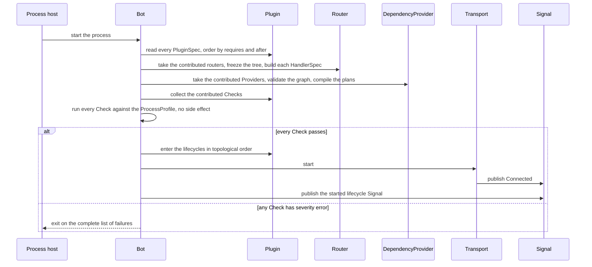
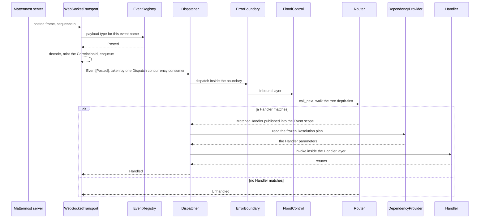
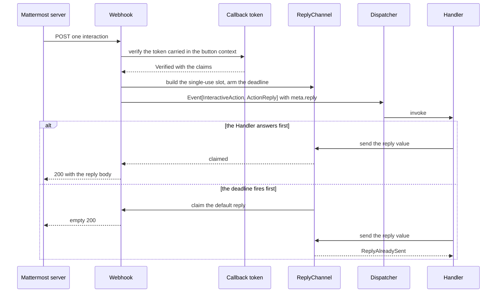
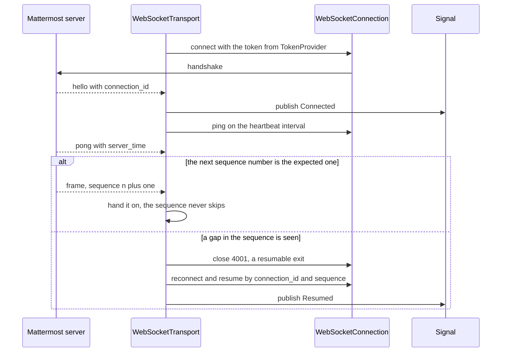
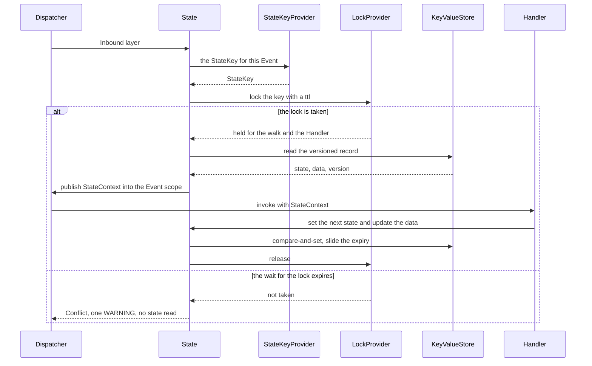
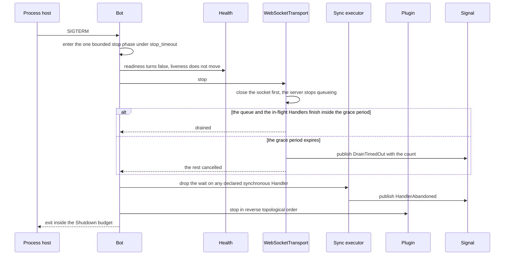
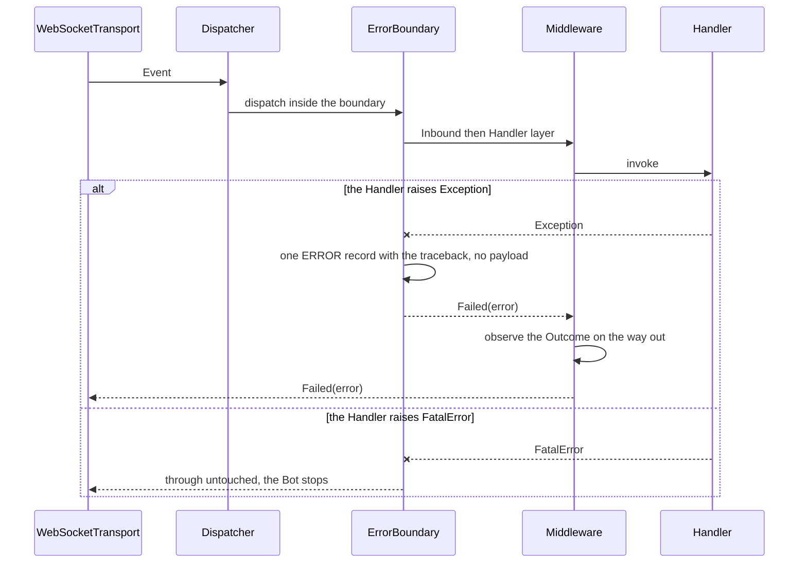
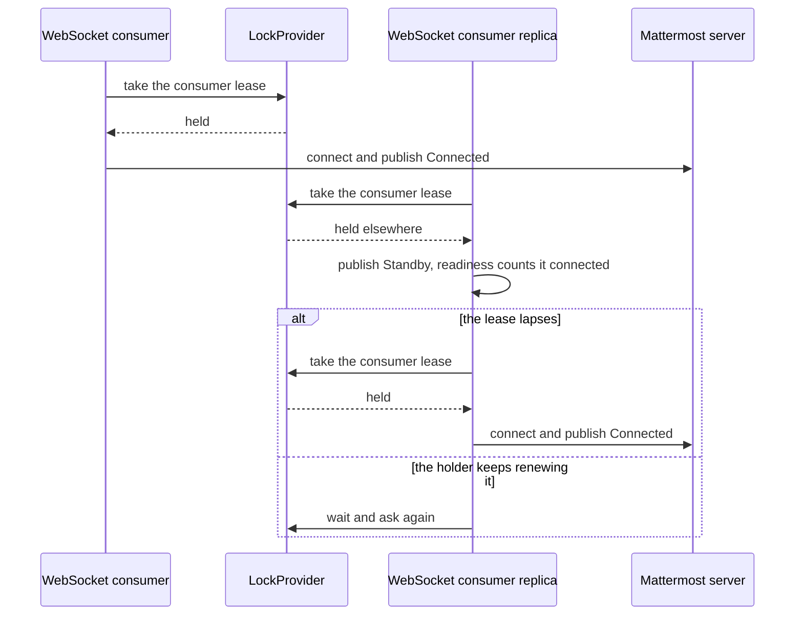

# 6. Runtime view

_Status: reviewed (#39)._

Eight orders that no single component owns. Each one fixes the sequence in which the boxes of
[§5](05-building-block-view.md) call each other, and each is the only place its sequence is written
down.

## 6.0 How to read this section

**What a scenario is here.** One order between boxes, drawn once, with the branch that motivated the
design in the picture and every other outcome in a table beneath it
([ADR-0067](../adr/0067-a-runtime-scenario-is-one-order-between-boxes.md)). A component design
document draws the same interaction only where it opens a step invisible from outside its box, and
links here otherwise; where the two disagree about the order, this section is the one that is right.

**The five parts of a scenario.** *Why it is here* — the sentence by which arc42 admits a scenario
at all. The diagram. *Notable aspects* — what the picture cannot show: an invariant, who owns a
deadline, what is deliberately absent. The branch table. *Crosses* — the component documents the
order passes through, which inherit it.

**Where a failure goes.** The same failure reaches three sections on three different questions: this
one states the order and where it splits, [§8](08-cross-cutting-concepts.md) states the rule the
mechanism follows, and §10 states the measurable stimulus and response (ADR-0067).

**Participants.** Every lifeline is an element of the building block view — a component, a part or a
seam of [§5](05-building-block-view.md), at the level the scenario is about: 6.8 is about two
processes, so its lifelines are the containers of [§5.2](05-building-block-view.md#52-level-2--containers).
External lifelines are the partners of [§3](03-context-and-scope.md). `Handler` is the one lifeline
that is neither: it is the application's own function, which is exactly the boundary
[§3.3](03-context-and-scope.md#33-scope-the-line-between-the-framework-and-the-application) draws.

**The branch table.** *Branch point* is the lifeline where the order splits, *Trigger* is what makes
it split, *Outcome* is what the caller sees, and *Detail in* is the document that owns the mechanism
— a component document, an ADR or the open ticket that still owes the answer. A document that does
not exist yet is named without a link
([`documentation-style.md`](../documentation-style.md) §6).

## 6.1 Start-up: compose, check, start

**Why it is here.** The three phases run across five boxes and one external actor, and the property
that matters — nothing with a side effect happens until the whole configuration has been validated
— is visible only in the order.

**Notable aspects.** The freeze happens before the checks, which is why a Check may ask a question
about the whole tree — unreachable handlers, unresolvable parameters, the shutdown arithmetic — and
why no answer can change afterwards. Transports start last and stop first, so a plugin a Transport
depends on is never absent while an Event is in flight. `aiommbot check` runs the first two phases
and exits, which is the same order with the third box left out
([ADR-0016](../adr/0016-three-phase-start-with-checks.md),
[ADR-0058](../adr/0058-the-command-is-a-console-script-behind-the-click-extra.md)).

| Branch point | Trigger | Outcome | Detail in |
|---|---|---|---|
| `Bot` | a Check has severity *warning* | logged, the start continues | `bot.md` |
| `Plugin` | a Plugin raises while entering its lifecycle | the plugins already entered stop in reverse order | [#103](https://github.com/dmastapkovich/aiommbot/issues/103) |
| `Transport` | the socket is refused at start | backoff and retry inside the Transport, `Disconnected` published, the start does not fail | `websocket-transport.md` |
| `Bot` | the process is embedded through `serve()` | the host owns the signals and the loop; the order above is unchanged | [ADR-0064](../adr/0064-run-owns-the-stop-signals-and-serve-owns-none.md) |

**Crosses**: `bot.md`, `router.md`, `dependency-provider.md`, `signal.md`,
`websocket-transport.md`.

## 6.2 A post over WebSocket reaching a Handler

**Why it is here.** This is the framework's main path, and the order in it is the design: admission
before routing, routing before resolution, and a value rather than an exception at every exit.

**Notable aspects.** The Resolution plan is read, never computed: it was compiled in 6.1 and frozen,
so a delivery cannot fail on a dependency question. The walk stops at the first match, which is why
`Skip` continues it rather than ending it, and why two handlers that shadow each other are a
start-up question and not a runtime one. Nothing on this path tells anybody that a dispatch
happened: the fact is the `Outcome` the Transport receives, read by Middleware on the way out
([ADR-0013](../adr/0013-type-driven-routing-with-a-typed-dispatch-outcome.md),
[ADR-0019](../adr/0019-handler-parameter-resolution-rules.md),
[ADR-0048](../adr/0048-observability-is-not-a-core-seam.md)). The same order seen from the envelope,
where `derive` and the identifiers a log record may carry become visible, is
[`components/event.md`](components/event.md) §5.1.

| Branch point | Trigger | Outcome | Detail in |
|---|---|---|---|
| `FloodControl` | the Cooldown window is open, or this delivery id was seen | `Suppression` published into the Event scope, `Unhandled` returned, the walk never starts | `flood-control.md` |
| `FloodControl` | the `KeyValueStore` is unreachable | one WARNING and the Event is admitted — the plugin fails open | [ADR-0060](../adr/0060-flood-control-and-delivery-dedup-are-one-generic-plugin.md) |
| `Router` | a matched Handler raises `Skip` | the walk continues from the next candidate | `router.md` |
| `WebSocketTransport` | the bounded queue is full | the `OverflowPolicy` of the kind applies and `Dropped` is published | `websocket-transport.md` |
| `Handler` | the Handler raises | 6.7 | `error-boundary.md` |

**Crosses**: `websocket-transport.md`, `event-registry.md`,
[`components/event.md`](components/event.md), `dispatcher.md`, `middleware.md`,
`error-boundary.md`, `flood-control.md`, `router.md`, `dependency-provider.md`.

## 6.3 An interactive callback and its Reply channel

**Why it is here.** Two clocks run against each other — the platform's wait for an HTTP response and
the Handler's work — and the order is what keeps them from colliding: authenticity is decided before
an Event exists, and the reply slot is claimed exactly once whichever clock wins.

**Notable aspects.** Verification precedes the envelope, so a request that fails it produces no
Event at all and nothing downstream ever sees it. The slot is claimed before the write, which makes
the invariant *at most one reply is accepted* rather than *at most one is attempted*; a Handler that
loses the race is told so by a value and continues through the Runtime
([ADR-0024](../adr/0024-webhook-ingress-and-callback-security.md),
[ADR-0036](../adr/0036-reply-slot-as-a-second-type-parameter-over-a-core-owned-reply-channel.md)).
The slot's own states, and what the Core promises about them, are
[`components/event.md`](components/event.md) §5.2–§5.3.

| Branch point | Trigger | Outcome | Detail in |
|---|---|---|---|
| `Callback token` | the token is expired or already used | a routable `Event[StaleAction]` is built instead, and the reply slot is armed as usual | `callback-token.md` |
| `Callback token` | the token is missing or invalid while authenticity is on | empty 404, no Event built, nothing logged beyond the refusal | `webhook.md` |
| `Callback token` | authenticity is explicitly `off` | the claims are absent and the Event is built from the payload alone | [ADR-0024](../adr/0024-webhook-ingress-and-callback-security.md) |
| `ReplyChannel` | the connection is gone before the write | the slot stays claimed and the write raises to the Handler | `webhook.md` |

**Crosses**: `webhook.md`, `callback-token.md`, [`components/event.md`](components/event.md),
`dispatcher.md`, `runtime.md`.

## 6.4 Reconnect with resume, and a sequence gap

**Why it is here.** One supervised loop decides between four different meanings of a silent socket,
and the order in which it decides is what keeps a bot from double-processing or from silently
losing deliveries.

**Notable aspects.** Continuity is a property of the reader, not of the network: the loop closes a
connection that has skipped rather than accepting it, because a gap it cannot fill is the one
condition under which the design would rather reconnect than continue. The reader never stalls on a
slow consumer — backpressure is the bounded queue and its per-kind `OverflowPolicy`, which is 6.2's
table — and every wait on this path is an explicit timeout driven through the `Clock` seam
([ADR-0023](../adr/0023-websocket-gateway-resilience.md),
[ADR-0031](../adr/0031-stdlib-asyncio-with-a-fixed-concurrency-discipline.md),
[ADR-0059](../adr/0059-clock-is-the-thirteenth-seam-of-the-core.md)).

| Branch point | Trigger | Outcome | Detail in |
|---|---|---|---|
| `WebSocketTransport` | the silence monitor expires | a transient exit, `Disconnected`, full-jitter backoff, then resume | `websocket-transport.md` |
| `Mattermost server` | the server answers with a new `connection_id` | the resume was refused; `Resynced(since)` reports the loss window, and backfilling it is [#55](https://github.com/dmastapkovich/aiommbot/issues/55) | `websocket-transport.md` |
| `AuthLossDetector` | the ping reply is `not_authenticated` | `/users/me` is probed; a 200 means a network fault and the same token reconnects | `auth-loss-detector.md` |
| `AuthLossDetector` | the probe answers 401 after one refresh | `FatalError(AuthRevoked)` carrying ids and a digest, never the token; the Bot stops | `auth-loss-detector.md` |
| `WebSocketTransport` | the backoff has grown past its first steps | `Degraded` is published so readiness and the operator see it | `websocket-transport.md` |

**Crosses**: `websocket-transport.md`, `auth-loss-detector.md`, `signal.md`, `face.md`.

## 6.5 A state transition under event isolation

**Why it is here.** Two deliveries for the same conversation may arrive at once, and the order here
is the whole of the isolation guarantee: the lock is taken before the state is read and released
after the Handler returns, so a transition is decided on state nobody else can have changed.

**Notable aspects.** The state is read *after* the lock is taken and never before, which is the
difference between isolation and a cache. The lock spans the walk as well as the Handler, because a
filter that gates on state would otherwise decide on a value the Handler no longer sees. The write
is a compare-and-set even under the lock: the lock has a ttl and the store may have expired it, so
the version is the authority
([ADR-0022](../adr/0022-state-plugin-model.md)).

| Branch point | Trigger | Outcome | Detail in |
|---|---|---|---|
| `KeyValueStore` | the record carries another schema version, or a state no Flow declares | `StaleState`, the record is reset and a Signal is published | `state.md` |
| `KeyValueStore` | the compare-and-set is refused | `Conflict` — the lock lapsed and another delivery wrote first | `state.md` |
| `KeyValueStore` | the record's logical ttl has passed | the conversation starts from no state, which is not a failure | `state.md` |
| `State` | the store is unreachable | undecided: FloodControl fails open by ADR-0060 and no rule covers this seam's other consumers | [#107](https://github.com/dmastapkovich/aiommbot/issues/107) |

**Crosses**: `state.md`, `key-value-store.md`, `middleware.md`, `dispatcher.md`, `filter.md`.

## 6.6 Graceful shutdown and the Drain

**Why it is here.** Five boxes stop in a fixed order inside three nested budgets, and neither the
order nor the nesting can be read off any one of them.

**Notable aspects.** The socket closes before the drain rather than after it, so the server stops
queueing for a consumer that is leaving and the drain is a finite amount of work. Readiness falls at
the first instruction of the phase while liveness never moves, because a process that is stopping
correctly must not be restarted for it. The Sync executor is the one box the phase cannot command: a
synchronous Handler is uncancellable, so the wait is dropped and the thread is reported rather than
stopped. What the numbers are, and what happens when the host's clock is shorter than ours, is
[§7.4](07-deployment-view.md); what the mechanism promises is
[§8.10](08-cross-cutting-concepts.md#810-graceful-shutdown-and-the-drain).

| Branch point | Trigger | Outcome | Detail in |
|---|---|---|---|
| `Process host` | a second stop signal | `stop_timeout` collapses to zero and the phase ends at once | [ADR-0064](../adr/0064-run-owns-the-stop-signals-and-serve-owns-none.md) |
| `Plugin` | a Plugin raises while stopping | logged, the remaining plugins still stop | [#103](https://github.com/dmastapkovich/aiommbot/issues/103) |
| `Bot` | `stop_timeout` expires before the plugins are done | cleanup is cut short, still inside the declared budget | [ADR-0063](../adr/0063-the-process-declares-its-shutdown-budget-and-the-bot-bounds-the-stop.md) |
| `Process host` | the budget expires | the process is killed and nothing of ours runs; the budget is a requirement on the host | [§7.4](07-deployment-view.md) |
| `Bot` | the Bot was embedded through `serve()` | no signal handler of ours exists and the host drives the same phase | [ADR-0064](../adr/0064-run-owns-the-stop-signals-and-serve-owns-none.md) |

**Crosses**: `bot.md`, `websocket-transport.md`, `sync-executor.md`, `health.md`, `signal.md`.

## 6.7 A Handler failure and its observability trail

**Why it is here.** A failure is the one path where the framework must decide what to do *on the
application's behalf*, and the order says what it does: catch once, record once, and answer with a
value — except for the two classes it must never touch.

**Notable aspects.** Exactly one ERROR record exists per escaped exception, and it is written at the
boundary rather than where the exception was raised, which is what makes the count of ERROR records
equal to the count of failed deliveries. The record carries the envelope's identifiers and never its
content. The boundary is the outermost link of the chain and cannot be removed, so `Failed(error)`
is a value every Middleware sees on the way out and every Transport must branch on
([ADR-0021](../adr/0021-core-error-boundary.md),
[ADR-0052](../adr/0052-log-levels-by-frequency-and-audience.md),
[ADR-0055](../adr/0055-one-redaction-list-over-two-sinks.md)).

| Branch point | Trigger | Outcome | Detail in |
|---|---|---|---|
| `ErrorBoundary` | the Handler raises a `BaseException` such as `CancelledError` | through untouched; structured concurrency owns it | [ADR-0031](../adr/0031-stdlib-asyncio-with-a-fixed-concurrency-discipline.md) |
| `Middleware` | a Middleware itself raises | the boundary is outside the chain, so it is caught the same way | `error-boundary.md` |
| `WebSocketTransport` | the `Outcome` is `Failed(error)` | the delivery is not retried and not dead-lettered by us | [ADR-0057](../adr/0057-reliability-middlewares-and-error-reporting-stay-outside.md) |
| `ErrorBoundary` | an error tracker is configured by the application | it is reached from a Middleware, not from the boundary | [#104](https://github.com/dmastapkovich/aiommbot/issues/104) |

**Crosses**: `error-boundary.md`, `middleware.md`, `dispatcher.md`, `observability.md`,
`websocket-transport.md`.

## 6.8 A standby consumer takes the lease

**Why it is here.** This is the only order in the design in which two processes take part, and the
one constraint the whole deployment rests on — at most one WebSocket consumer per bot account — is
enforced nowhere else.

**Notable aspects.** The lifelines here are processes rather than components, because the
interaction is between two copies of the same box. Standby is the absence of a lease and never the
absence of a connection, so a holder that has lost its socket stays `Disconnected` and not ready
while the replica stays `Standby`; the two states cannot both be true of one Transport. A standby
process is ready by design and handles no Event, which an operator learns from the Signal and not
from a probe — the probe body is empty and stays empty
([ADR-0005](../adr/0005-one-ingress-many-workers.md),
[ADR-0023](../adr/0023-websocket-gateway-resilience.md),
[ADR-0065](../adr/0065-a-transport-waiting-on-the-consumer-lease-is-standby-and-counts-as-ready.md)).

| Branch point | Trigger | Outcome | Detail in |
|---|---|---|---|
| `LockProvider` | no lease is configured at all | every replica connects, and the single-consumer constraint is the deployment's to keep | [§7.2](07-deployment-view.md) |
| `LockProvider` | the store is unreachable | the lease cannot be taken; what either process then reports is undecided | [#107](https://github.com/dmastapkovich/aiommbot/issues/107) |
| `WebSocket consumer` | the holder is stopping | 6.6 runs there while the replica is still waiting; the lease is released at its end | `websocket-transport.md` |
| `WebSocket consumer replica` | it takes the lease after a gap | it resumes nothing — it is a new connection, and the gap is 6.4's `Resynced(since)` | [#55](https://github.com/dmastapkovich/aiommbot/issues/55) |

**Crosses**: `websocket-transport.md`, `key-value-store.md`, `health.md`, `signal.md`.
