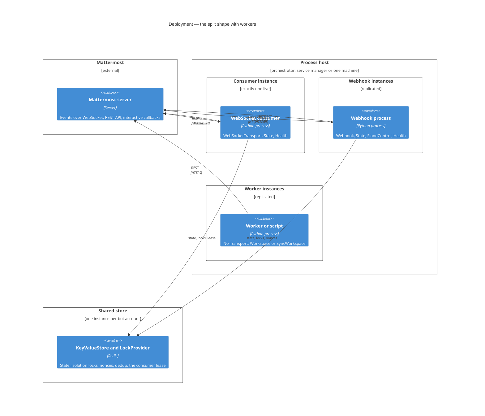

# 7. Deployment view

_Status: reviewed (#40)._

Where a bot built on aiommbot runs: what the design asks of any host, which processes a deployment
runs and what each composes, what they must share, and the arithmetic of stopping. The concepts
behind the mechanisms named here — the Drain, the probes, backpressure, idempotency, security — are
[§8](08-cross-cutting-concepts.md); this section is infrastructure and the mapping onto it.

## 7.1 What the design asks of a host

The framework starts no process, no server and no scheduler
([ADR-0002](../adr/0002-core-scope-two-condition-test.md)), so everything below is a requirement on
whatever runs the process. Six of them, and what happens when a host does not meet one.

| Requirement | Why | If the host does not meet it |
|---|---|---|
| A stop signal delivered to our process | `run()` catches SIGINT and SIGTERM and enters the stop phase ([ADR-0064](../adr/0064-run-owns-the-stop-signals-and-serve-owns-none.md)) | the Drain never starts; the process is killed at the end of the budget with nothing in its log |
| A Shutdown budget longer than the Drain deadline | the Drain runs 25 s and the stop phase around it 28 s ([ADR-0063](../adr/0063-the-process-declares-its-shutdown-budget-and-the-bot-bounds-the-stop.md)) | the kill lands mid-Drain: no `finally`, no `DrainTimedOut`, no final flush |
| Somewhere to run one or more ASGI callables | the Webhook and the Health Plugin expose them and host none ([ADR-0024](../adr/0024-webhook-ingress-and-callback-security.md), [ADR-0061](../adr/0061-health-is-a-generic-plugin-over-application-supplied-checks.md)) | no interactive callbacks, no probes |
| One store every process of a shape can reach | conversation state, isolation locks, nonces, dedup and the consumer lease are shared facts ([ADR-0022](../adr/0022-state-plugin-model.md)) | 7.4, per kind of key |
| Exactly one live WebSocket consumer per bot account | every connection of an account receives every event ([ADR-0005](../adr/0005-one-ingress-many-workers.md)) | every event is processed twice |
| A way to observe the process without a request | for a consumer there is no inbound traffic to infer health from ([ADR-0061](../adr/0061-health-is-a-generic-plugin-over-application-supplied-checks.md)) | a wedged bot looks identical to an idle one |

Two of the six are declared to the framework rather than merely arranged: the Shutdown budget and
the consumer role are fields of the `ProcessProfile`, and start-up Checks are evaluated against them
([ADR-0016](../adr/0016-three-phase-start-with-checks.md)). The declaration is a promise about the
host, and the framework cannot verify it — 7.5 names the three ways it becomes false.

## 7.2 The Process shapes

Every process is the same `Bot` object with a different plugin list and a different
`ProcessProfile`; there is no second build and no framework container image. The shapes are the ones
[§5.2](05-building-block-view.md) draws as containers.

| Shape | Processes | `ProcessProfile` | When |
|---|---|---|---|
| All in one | one, composing WebSocketTransport, Webhook, State and Health | `single_process=True, websocket_consumer=True` | a small bot on one instance; the in-memory backends are legal here and only here |
| Split | one WebSocket consumer; N Webhook processes behind a load balancer | consumer: `websocket_consumer=True`; Webhook: neither flag | interactive buttons and dialogs that must survive a consumer restart |
| Split with workers | either of the above, plus processes with no Transport | workers: neither flag | work that does not fit inside a reply deadline |

A worker composes no Transport and constructs a `Workspace` or a `SyncWorkspace` directly
([ADR-0029](../adr/0029-synchronous-face-from-a-sans-io-core-with-thin-drivers.md)), which is why a
synchronous task queue or a one-off script needs no Bot at all.



| Node | What runs on it | Replicates | Reason |
|---|---|---|---|
| Consumer instance | the WebSocket consumer process | no — a second replica is a `Standby` on the lease | one connection per account receives every event ([ADR-0005](../adr/0005-one-ingress-many-workers.md), [ADR-0065](../adr/0065-a-transport-waiting-on-the-consumer-lease-is-standby-and-counts-as-ready.md)) |
| Webhook instances | the Webhook process and the ASGI server the application runs | yes, behind a load balancer | a callback carries its own context and shares a 30 s platform deadline ([ADR-0024](../adr/0024-webhook-ingress-and-callback-security.md)) |
| Worker instances | processes with no Transport | yes | nothing routes to them |
| Shared store | the Redis backing both storage seams | one logical instance per bot account | 7.4 |

## 7.3 Hosting the ASGI callables

**Nothing in the framework starts an HTTP server** — not a Plugin, not the Core, and not the
`aiommbot` command
([ADR-0058](../adr/0058-the-command-is-a-console-script-behind-the-click-extra.md)). Two Plugins
expose an ASGI callable and a host runs it, and a third path comes from a library rather than from
us. A process mounts what it composes, on one server and one port.

| Path | ASGI application | Owner | Present when |
|---|---|---|---|
| the callback path the bot puts in its buttons | `webhook_app(bot)` | aiommbot | the Webhook is in the plugin list |
| `/livez`, `/readyz` | `health_app(bot)` | aiommbot | the Health Plugin is in the plugin list |
| `/metrics` | `make_asgi_app(registry)` | `prometheus_client` | `PrometheusPlugin` is composed; the registry is the application's ([ADR-0051](../adr/0051-first-party-observability-plugin.md)) |
| — | none | — | OpenTelemetry pushes over OTLP and is scraped by nobody |

One port carries all of them, mounted in the application's own ASGI app — for example
`app.mount("/mm", webhook_app(bot))` beside `app.mount("/", health_app(bot))`, with the Bot started
in the ASGI lifespan. **The cost is worth naming**: a burst of callbacks delays a probe on the same
server, and a probe's read timeout is short by default, so a Webhook process under load can be
declared not ready by its own success. A second server on a second port is the answer where that
matters, and it is the operator's call rather than ours.

A process whose only connection is the outbound socket has no HTTP of its own, so it composes the
Health Plugin and runs `health_app(bot)` under a small server it starts itself; that is what Slack's
Bolt example and `cloudflared` both do
([`docs/research/26`](../research/26-schedule-reliability-and-probe-primitives.md) §7.4). A process
that answers 404 on `/readyz` has not composed the Health Plugin, and that is a composition error
rather than a probe failure.

An ASGI host bounds none of this for us: uvicorn and granian wait for a `lifespan` shutdown without
any deadline ([`docs/research/29`](../research/29-kubernetes-fields-a-drain-depends-on.md) §10), so
an embedded Bot's own stop timeout is the only bound before the host's kill.

## 7.4 What the processes share

Five kinds of key live in the store, and they are shared by different sets of processes. Getting
this wrong is silent: every one of these deployments starts.

| Data | Must be seen by | If it is not shared |
|---|---|---|
| `Flow` state and isolation locks | every process that dispatches Events for the same conversations | two processes answer the same dialogue step, and per-key isolation stops isolating |
| Callback nonces, when the opt-in `NonceStore` is enabled | every Webhook replica | a replayed button is accepted by any replica that has not seen it |
| The consumer lease | every consumer replica | both replicas open a socket and every event is processed twice |
| `Cooldown` and delivery dedup | every process that dispatches Events | the limit is enforced per replica, so N replicas allow N times the traffic |
| `IdentityCache` entries | nobody — a per-process cache is correct | one extra lookup after a restart |

The in-memory backends are process-local, so they are legal only under `single_process=True`; the
backends themselves contribute the Check that says so, which is why a Webhook process with an
in-memory nonce store now fails to start instead of silently accepting replays
([ADR-0066](../adr/0066-the-in-memory-backends-own-the-single-process-check.md)).

## 7.5 Stopping: the arithmetic

Three numbers nest, and the outermost belongs to the host.

```text
Shutdown budget   30 s  ├───────────────────────────────────────────────┤
  stop_timeout    28 s  ├─────────────────────────────────────────┤ 2 s reserve
    Drain         25 s  ├───────────────────────────────────┤ 3 s for plugin stops
                        │ close the socket, then work the queue and the
                        │ in-flight Handlers, then cancel with DrainTimedOut
```

The Drain deadline is [ADR-0023](../adr/0023-websocket-gateway-resilience.md)'s, the stop timeout
and the declared budget are
[ADR-0063](../adr/0063-the-process-declares-its-shutdown-budget-and-the-bot-bounds-the-stop.md)'s,
and `drain_grace < stop_timeout <= shutdown_budget` is a start-up Check, so `aiommbot check` fails
in CI rather than the first rollout failing in production. Raise one number and the Check tells you
which others must move.

**The declaration is a promise, and three things make it false.** A delete may shorten the budget on
the way in; a forced delete removes it altogether; and a host may have a shutdown clock of its own
that the process never sees
([`docs/research/29`](../research/29-kubernetes-fields-a-drain-depends-on.md) §2). In all three the
kill is uncatchable, so nothing is written down about what was lost. That is the reason a
synchronous Handler must be idempotent and the reason the Drain closes the socket first
([§8.9](08-cross-cutting-concepts.md), [§8.10](08-cross-cutting-concepts.md)).

## 7.6 On Kubernetes

Four things must be right for a 25 s Drain, and half of them are not Kubernetes fields at all
([`docs/research/29`](../research/29-kubernetes-fields-a-drain-depends-on.md) §9): the grace period
and the workload kind are the manifest's, the entry-point form is the image's, and the signal
handler is the process's — so no amount of manifest reaches the other half.

| Field or property | Default | What to do, and what the default costs |
|---|---|---|
| `terminationGracePeriodSeconds` | 30 | Write it down even though it equals the default: it is the contract with the Drain deadline, and it must move whenever that deadline does. Below the Drain, SIGKILL lands mid-Drain and nothing is reported. |
| entry point form | image-dependent | The exec form, always. The shell form makes `/bin/sh` PID 1, which "does not pass signals", so the whole grace period elapses with the Drain never started — and the only symptom is that termination always takes exactly the budget. |
| a SIGTERM handler | none in `asyncio` | `run()` installs it ([ADR-0064](../adr/0064-run-owns-the-stop-signals-and-serve-owns-none.md)). A Bot embedded through `serve()` inherits its host's handler instead. |
| `strategy.type` / workload kind | `RollingUpdate` | For the consumer, see below. For Webhook processes and workers the default is correct. |
| `readinessProbe` → `/readyz` | absent | Set it. With no Service it changes no traffic, but the Pod `Ready` condition drives `minReadySeconds`, `maxUnavailable`, `progressDeadlineSeconds` and PodDisruptionBudget ([`docs/research/27`](../research/27-application-contributed-readiness-checks.md) §3). |
| `livenessProbe` → `/livez` | absent | Set it to restart a wedged process. It does nothing for the Drain: the kubelet stops liveness and startup probes at the first step of termination, so it cannot kill a draining container (same note, §5). |
| `lifecycle.preStop` | absent | Leave it absent on the consumer: there is no EndpointSlice to propagate out of and a sleep is charged against the same budget. On a Webhook process, which a Service does select, a short `sleep` is the documented way to cover endpoint propagation (same note, §3). |
| `minReadySeconds` | `0` | Raise it, or a revision that connects and immediately fails counts as a successful rollout. |
| PodDisruptionBudget | none | `minAvailable: 1` makes a node drain wait rather than take the only consumer; it stops guarding once deletion has begun. |

**The workload kind for the consumer is a choice with no clean winner**, and the design does not
make it for the operator:

| Choice | What it bounds | What it costs |
|---|---|---|
| Deployment, `RollingUpdate` | nothing — `maxSurge` admits an overlapping Pod | two live consumers during every rollout |
| Deployment, `Recreate` | upgrades only: old Pods go before new ones arrive | an outage window per rollout, and no guarantee on eviction, preemption or a manual delete |
| StatefulSet | "at most one Pod with a given identity" | ordered one-at-a-time rollouts; force deletion voids the guarantee |

None of the three removes the need for the lease of
[ADR-0023](../adr/0023-websocket-gateway-resilience.md), because the strongest of them is defeated
by force deletion and by network partitions. A bot that must never double-process configures the
lease and reads `Standby` to know the second replica is behaving
([ADR-0065](../adr/0065-a-transport-waiting-on-the-consumer-lease-is-standby-and-counts-as-ready.md)).


## 7.7 On Docker Compose

Compose is the second host worth writing down, and its default is the opposite of Kubernetes': the
budget is **10 s**, so **fifteen seconds of a 25 s Drain never happen**, on every stop, recreate and
`down` ([`docs/research/36`](../research/36-compose-fields-a-drain-depends-on.md) §1).

| Field or property | Default | What to do, and what the default costs |
|---|---|---|
| `stop_grace_period` | `10s` | Raise it above the Drain — the one change without which nothing else matters. |
| `--timeout` on `down`, `stop` and `up` | — | Never pass one smaller than `stop_grace_period`: the flag overrides the file downward. |
| entry point form, or `init: true` | image-dependent | The exec form, for the same reason as on Kubernetes: otherwise the process is not PID 1 and never sees the signal. |
| `stop_signal` | SIGTERM | Leave it. An image `STOPSIGNAL` changes which signal arrives, and `run()` handles SIGINT and SIGTERM and nothing else. |
| `pre_stop` | absent | Leave it absent. It is a command run in the container rather than a signal to the process, and the published reference says it "won't run if the container stops by itself or is terminated suddenly" — so it is not a shutdown path anything may depend on. |
| `healthcheck` | absent | It is a command run **inside** the container, never an HTTP request the host makes, so probing `/livez` needs an HTTP client in the image. |
| `restart` / `deploy.restart_policy` | `no` / `any` | The two disagree, and `deploy.restart_policy` wins when present — so adding that block turns restarting on. A Bot that stopped on a `FatalError` is a configuration failure and must not be restarted in a loop. |
| `deploy.replicas` | 1 | Compose offers no at-most-one guarantee of any kind, so a consumer here relies on the lease alone. |

**Compose has no liveness and no readiness.** A health check reports a status and gates
`depends_on: condition: service_healthy` at start-up; nothing restarts an unhealthy container, and
nothing distinguishes "restart me" from "do not send me traffic" (same note, §3). Health here is an
observation, not a control loop — which is exactly why the Health Plugin's liveness path stays true
through the whole Drain: on this host a failing liveness would be seen by a human, and on a host
with a supervisor it would restart a bot that is finishing its last events
([ADR-0061](../adr/0061-health-is-a-generic-plugin-over-application-supplied-checks.md)).
