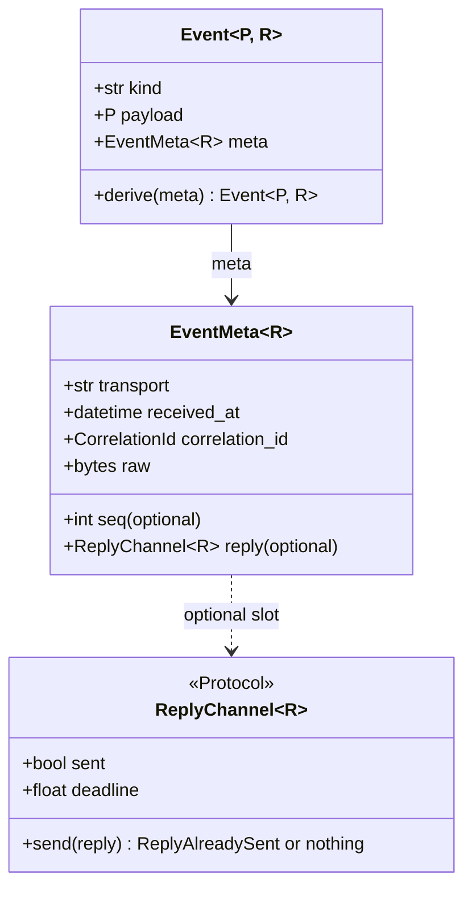
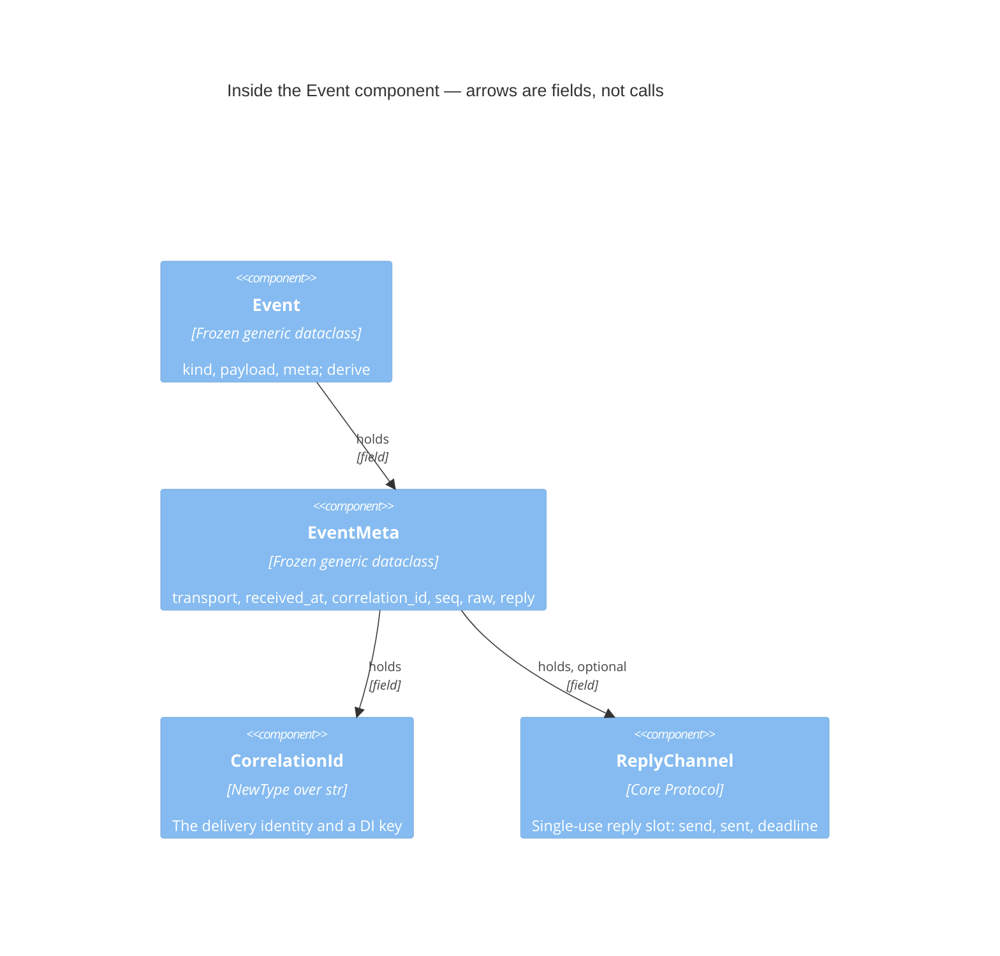
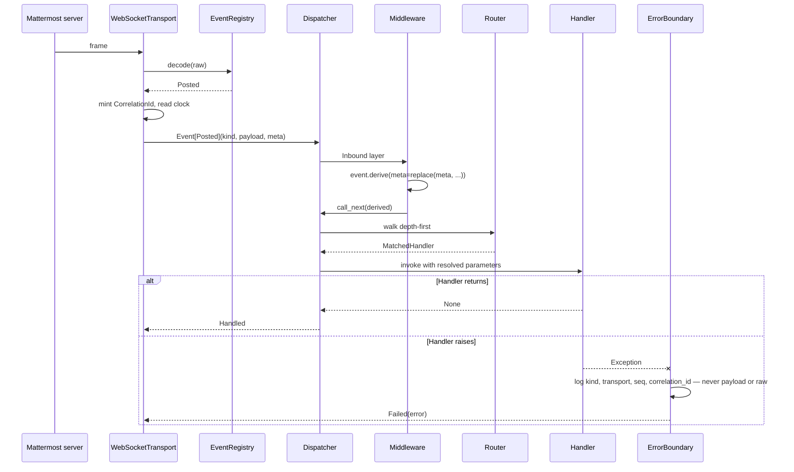
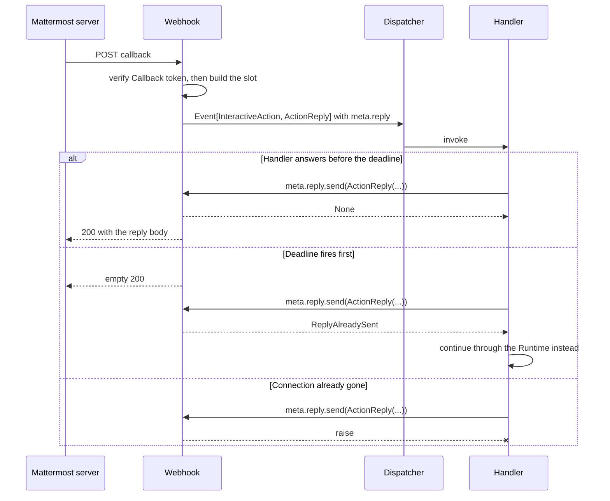
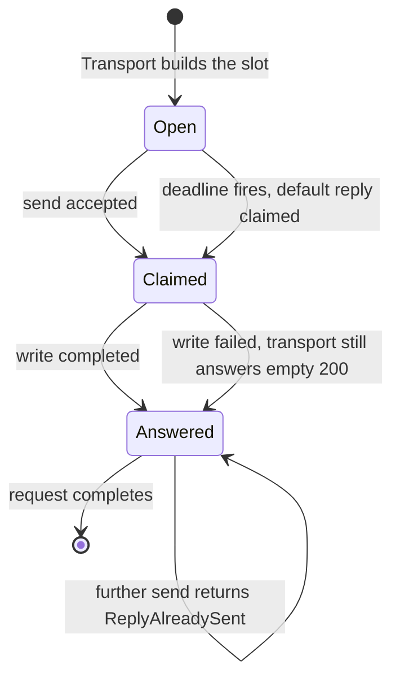

# Event

_Status: reviewed._
_Layer: core._
_ADRs: [ADR-0012](../../adr/0012-generic-event-envelope-with-adapter-payloads.md),
[ADR-0019](../../adr/0019-handler-parameter-resolution-rules.md),
[ADR-0020](../../adr/0020-two-layer-middleware-chain.md),
[ADR-0024](../../adr/0024-webhook-ingress-and-callback-security.md),
[ADR-0032](../../adr/0032-layer-model-and-direction-of-allowed-dependencies.md),
[ADR-0034](../../adr/0034-typed-outcomes-for-caller-branches-exceptions-for-broken-contracts.md),
[ADR-0036](../../adr/0036-reply-slot-as-a-second-type-parameter-over-a-core-owned-reply-channel.md),
[ADR-0037](../../adr/0037-derive-is-the-only-enrichment-path-for-an-event.md),
[ADR-0038](../../adr/0038-seam-inventory-records-the-direction-of-the-call.md).
Research: [`docs/research/11`](../../research/11-webhook-ingress-patterns.md),
[`docs/research/19`](../../research/19-provided-and-required-protocol-inventories.md)._

## 1. Purpose and boundaries

Event is the immutable generic envelope every Transport hands to the Core and every other Core
component reads: it carries the platform event name, one typed Payload and the delivery metadata
that routing, middleware, logging and dependency injection all key off. It is the box named *Event*
in [§5.5](../05-building-block-view.md#55-level-3--the-core), and it is the one place where "what
arrived" is separated from "what it means" — the Core knows the envelope and never a concrete
Payload ([ADR-0012](../../adr/0012-generic-event-envelope-with-adapter-payloads.md)). Outside it:
the Payload types and their names, which the Adapter's [EventRegistry](event-registry.md) owns;
decoding the wire into a Payload, which is the Adapter's too; the concrete reply values a webhook
callback may send, which [`webhook.md`](webhook.md) owns; and every decision made *about* an
Event — matching, dispatch, the order of enrichment — which belongs to [Filter](filter.md),
[Router](router.md), [Dispatcher](dispatcher.md) and [Middleware](middleware.md).

## 2. Responsibilities and non-responsibilities

- Owns: the generic envelope `Event[P, R]` and its single method `derive`; the `EventMeta[R]` record
  and every field in it; the `CorrelationId` type that
  [ADR-0019](../../adr/0019-handler-parameter-resolution-rules.md) makes a built-in injectable key;
  the `ReplyChannel[R]` Protocol that types the optional reply slot
  ([ADR-0036](../../adr/0036-reply-slot-as-a-second-type-parameter-over-a-core-owned-reply-channel.md));
  and the immutability, agreement and single-use invariants those types promise the whole Core.
- Does **not** own:
  - the Payload types, their platform names and their decoding — [EventRegistry](event-registry.md);
  - the concrete reply values, their deadline behaviour and `ReplyAlreadySent` —
    [`webhook.md`](webhook.md), which implements `ReplyChannel[R]` as `ActionReply` and
    `DialogReply` ([ADR-0024](../../adr/0024-webhook-ingress-and-callback-security.md));
  - minting a `CorrelationId` and filling `EventMeta` — the Transport that received the delivery
    ([`websocket-transport.md`](websocket-transport.md), [`webhook.md`](webhook.md));
  - the sequence bookkeeping and replay dedup that `meta.seq` feeds, and the `connection_id` that
    dedup pairs it with — [`websocket-transport.md`](websocket-transport.md);
  - who may derive an enriched envelope and in what order — [Middleware](middleware.md)
    ([ADR-0020](../../adr/0020-two-layer-middleware-chain.md));
  - anything injected *beside* the envelope — [DependencyProvider](dependency-provider.md);
  - constructing envelopes in tests — the event builders of the testing toolkit (#25).

## 3. Public contract

Everything below is public; this component has no `_internal` names, because an envelope with a
hidden part would be a value its readers cannot trust.

**`Event[P, R = Never]`** — `@final`, `@dataclass(frozen=True, slots=True, kw_only=True)`
(`ST-TYP-05`, `ST-TYP-08`), PEP 695 generics (`ST-TYP-02`) with the `R` default from the compat
module (`ST-TYP-09`). `P` is the Payload; `R` is the type the reply slot accepts, defaulted so that
`Event[Posted]` needs no second argument and a callback is written
`Event[InteractiveAction, ActionReply]`
([ADR-0036](../../adr/0036-reply-slot-as-a-second-type-parameter-over-a-core-owned-reply-channel.md)).
Fields: `kind: str` — the platform event name verbatim from the wire, kept a plain string because
it arrives as one and the Router keys off annotations rather than off this field
([ADR-0013](../../adr/0013-type-driven-routing-with-a-typed-dispatch-outcome.md));
`payload: P`; `meta: EventMeta[R]`.

`derive(*, meta: EventMeta[R]) -> Event[P, R]` is the whole enrichment surface and the only method
on the envelope: it accepts a replacement `EventMeta` and nothing else, so ADR-0020's "enrich
`meta`, never touch `payload` or `kind`" is a signature rather than a review note
([ADR-0037](../../adr/0037-derive-is-the-only-enrichment-path-for-an-event.md)).

**`EventMeta[R]`** — `@final`, the same dataclass shape, and a built-in injectable key
([ADR-0019](../../adr/0019-handler-parameter-resolution-rules.md)):

| Field | Type | Meaning | Filled by |
|---|---|---|---|
| `transport` | `str` | The `PluginSpec` name of the Transport that delivered this event — a name, never the Transport object, so a Handler cannot reach the transport through its envelope | the Transport |
| `received_at` | `datetime` | Timezone-aware receive time, read from the Transport's injected clock (`ST-TST-09`) | the Transport |
| `correlation_id` | `CorrelationId` | Identifies **one delivery**; never absent | the Transport |
| `seq` | `int \| None` | The transport's own sequence number; `None` for a transport that has none | the Transport |
| `raw` | `bytes` | The undecoded frame as it arrived: opaque to the Core, never logged, never carried by an exception | the Transport |
| `reply` | `ReplyChannel[R] \| None` | The single-use reply slot, present only for a request/response delivery | the Transport |

`raw` is `bytes` and not a parsed mapping on purpose: a mapping crossing the Core seam would be the
dictionary-as-record that `engineering-style.md` §3.3 bans, and would invite the Core to read
platform structure it is not allowed to know. Re-reading those bytes is the Adapter's business —
it is the same decode that produced the Payload.

**`CorrelationId`** — `NewType('CorrelationId', str)`, so it is a distinct dependency key in a
type-keyed resolver ([ADR-0018](../../adr/0018-core-owned-type-keyed-dependency-injection.md)), no
`str` parameter can accidentally receive one, and it costs nothing at runtime. It is minted per
delivery by the Transport, is the identifier every Core log record carries (`ST-LOG-06`), and is
what a user-visible failure quotes.

**`ReplyChannel[R]`** — the Core-owned Protocol that types `meta.reply`. It is the twelfth seam row
of the building-block view §5.4 and its fourteenth Protocol, and the only **provided** one: the Core
hands it to a Handler to call rather than calling out through it
([ADR-0036](../../adr/0036-reply-slot-as-a-second-type-parameter-over-a-core-owned-reply-channel.md),
[ADR-0038](../../adr/0038-seam-inventory-records-the-direction-of-the-call.md)):

- `async def send(self, reply: R) -> None | ReplyAlreadySent` — accepted at most once. "Already
  answered" is a branch the immediate caller takes in normal operation, so it is a typed outcome
  (`ST-ERR-01`); a failed write is a broken dependency and raises (`ST-ERR-02`), which gives each
  failure exactly one representation (`ST-ERR-05`).
- `sent: bool` and `deadline: float` — so a Handler can ask before it composes a reply it cannot
  send. The deadline's value, its default of 10 s and what happens when it fires are ADR-0024's and
  [`webhook.md`](webhook.md)'s; this Protocol only makes them readable.
- The docstring states the implementer's contract and names its conformance suite (`ST-DOC-03`,
  `ST-TST-02`); see [§10](#10-testing-strategy).

`ReplyAlreadySent` is named here as the fieldless marker [`webhook.md`](webhook.md) owns. It
creates no ordering edge, which is the marker clause of
[ADR-0035](../../adr/0035-lld-order-is-a-topological-sort-of-structural-contract-dependencies.md)
applied — the same ruling it makes for the exception roots of ADR-0021.

Nothing here is designed to be subclassed: `Event` and `EventMeta` are `@final` (`ST-TYP-08`),
`CorrelationId` is a `NewType`, and `ReplyChannel` is a Protocol implemented by composition
(`ST-PAT-05`, `ST-PAT-07`).

## 4. Internal structure

| Piece | Responsibility | Why it is separate |
|---|---|---|
| `Event` | Bind one `kind` to one Payload and one metadata record, and be impossible to change | It is the value every other Core component reads; keeping it three fields and one method is what makes "trust what you receive" checkable |
| `EventMeta` | Hold everything true about the *delivery* rather than about the event | It is injected on its own ([ADR-0019](../../adr/0019-handler-parameter-resolution-rules.md)) and it is the unit `derive` replaces wholesale, so the enrichment boundary needs a name |
| `CorrelationId` | Be one delivery's identity, distinguishable from any other string | Type-keyed injection cannot key on `str`, and `ST-LOG-06` needs one name for the field every log line and every user-visible failure carries |
| `ReplyChannel` | Type the reply slot without the Core knowing a reply value | Its implementation is an adapter-specific plugin and the Core may not import one ([ADR-0032](../../adr/0032-layer-model-and-direction-of-allowed-dependencies.md)); a Protocol needs no import from the implementer |

The pieces are *parts* in the sense of [§5.0](../05-building-block-view.md#50-how-to-read-this-section):
they are named pieces of one reason to change — the shape of a delivery — and not four
responsibilities (`ST-SOL-01`, `ST-MOD-09`). The component owns no task, no queue, no timeout and
no logger; every arrow above is a field, not a call.

## 5. Interactions

### 5.1 A WebSocket delivery reaching a Handler

The main path, and the failure branch that motivates the design: an exception inside the Handler
must reach observability with the envelope's identifiers and none of its content.

The envelope is a value throughout: it is built once, derived zero or more times in the Inbound
layer, and read by [Filter](filter.md), [Extractor](extractor.md), [Router](router.md) and the
Handler. Nothing in the walk mutates it, which is why the same envelope may be read by several
tasks without a lock ([§8](#8-failure-modes-and-invariants)).

### 5.2 A webhook callback and its reply slot

Verification runs *before* an Event exists, so a `Missing` or `Invalid` token never produces an
envelope at all ([ADR-0024](../../adr/0024-webhook-ingress-and-callback-security.md)); an `Expired`
or `Replayed` one produces a `StaleAction` envelope like any other. Both are
[`webhook.md`](webhook.md)'s and [`callback-token.md`](callback-token.md)'s to describe.

### 5.3 The reply slot's lifecycle

The envelope itself has no states — it is frozen. The one thing it carries that does is the slot,
and these are the states its Protocol makes observable; who drives each transition is
[`webhook.md`](webhook.md)'s.

The claim happens before the write, so a cancelled or failed write cannot be followed by a second
accepted `send`. The invariant is *at most one `send` is accepted*, not *at most one is attempted*.

## 6. Design patterns

**[Prototype](https://refactoring.guru/design-patterns/prototype)** — `derive` returns a copy of
this envelope with a replaced `EventMeta`, so a Middleware enriches an immutable value without
knowing how many fields the envelope has or constructing one itself. The problem it solves here is
ADR-0020's: enrichment on a frozen value, where the enricher must not be broken by a new metadata
field and must not be able to reach the payload. Rejected: `dataclasses.replace` in the open, which
type-checks a payload swap and turns the invariant into a review note
([ADR-0037](../../adr/0037-derive-is-the-only-enrichment-path-for-an-event.md)); and a mutable
envelope with setters, which ADR-0006 tenet 5 forbids and which would end the free sharing across
tasks.

**[Bridge](https://refactoring.guru/design-patterns/bridge)** (§3.1) — this component supplies the
abstraction half for the reply slot: `ReplyChannel[R]` is the interface the Handler programmes
against, and the implementation half is the Webhook plugin's. Our place in the catalogue row is the
Core-owned Protocol, not the two faces the row names, so `ST-PAT-01` applies in full rather than
`ST-PAT-02`: rejected alternative was a concrete reply object imported into the Core, which
ADR-0032 forbids outright, and the marker-base variant ADR-0036 records.

Considered and unused (`ST-PAT-09`):

- **[Null Object](https://refactoring.guru/design-patterns/null-object)** (§3.1) — a
  `NoReplyChannel` that discards sends would let every Handler call `send` unconditionally. Rejected:
  it hides the fact that a WebSocket delivery cannot answer, whereas `reply: … | None` with
  `R = Never` makes the checker force the branch.
- **[Builder](https://refactoring.guru/design-patterns/builder)** (§3.1) — an `EventBuilder` for
  Transports. Rejected: `kw_only=True` construction already names every field at the call site, and
  a half-built envelope is exactly what [§8](#8-failure-modes-and-invariants) forbids. Convenience
  construction for tests is the testing toolkit's event builders (#25).
- **[Decorator](https://refactoring.guru/design-patterns/decorator)** (§3.1) — wrapping an envelope
  to add fields. Rejected: a wrapper is not the frozen dataclass the seam promises, and enrichment
  already has one path.
- **[Memento](https://refactoring.guru/design-patterns/memento)** (§3.2, restricted) — snapshotting
  an envelope for replay. Rejected: the envelope is already immutable, so a snapshot would be a
  second name for the same value; replay is `meta.raw` decoded again by the Adapter.
- **Visitor** — double dispatch over payload kinds. Rejected: subscription is by annotation
  ([ADR-0013](../../adr/0013-type-driven-routing-with-a-typed-dispatch-outcome.md)), so there is no
  traversal to double-dispatch, and a Visitor would put payload knowledge in the Core.
- **[Flyweight](https://refactoring.guru/design-patterns/flyweight)** — sharing envelopes. Rejected:
  an envelope lives for one dispatch and pooling it would keep `raw` alive far longer than the
  retention this document promises.
- **[Strategy](https://refactoring.guru/design-patterns/strategy)** (§3.1) — nothing inside the
  envelope varies independently of it; the strategies of the dispatch path belong to
  [Filter](filter.md) and [`websocket-transport.md`](websocket-transport.md).

No banned pattern appears: there is no dictionary-as-record (`raw` is opaque bytes, not a bag), no
module-level state, no ambient context, and no attribute stashed on a foreign object (`ST-TYP-16`).

## 7. SOLID analysis

**S.** The component has one reason to change: the shape of a delivery. `EventMeta`,
`CorrelationId` and `ReplyChannel` are pieces of that one reason and not three more — a delivery has
metadata, an identity and, sometimes, a way back — which is the *part* distinction
[§5.0](../05-building-block-view.md#50-how-to-read-this-section) draws and `ST-SOL-01` permits. The
things that would be second reasons are all elsewhere: decoding is the Adapter's, matching is the
Router's, enrichment order is the Middleware's.

**O.** A new event kind, a new payload type and a new reply value are all added without editing
anything here: the kind is a string, the payload is `P`, and the reply is `R` behind a Protocol.
That is `ST-SOL-02`'s own example read from the other side — the Core must never grow
`if isinstance(event.payload, …)`, and it cannot, because it has no name to write on the right of
the `isinstance`.

**L.** `Event` and `EventMeta` are `@final`, so substitutability is a question about
`ReplyChannel[R]` only, and it is answered by mechanism: every implementation passes the same
conformance suite unchanged (`ST-SOL-03`), and the suite is parametrised over the Webhook slot and
the testing toolkit's recording slot. The generic behaves as the contract promises rather than as a
coincidence: `R` appears only in an argument position, so `Event` is contravariant in it and an
`Event[InteractiveAction, ActionReply]` is accepted where `Event[InteractiveAction]` is annotated —
a Handler that ignores the slot is correct, not merely tolerated. `ReplyChannel[Never]` has no
callable `send`, which is how "this delivery cannot be answered" becomes a type fact.

**I.** `ReplyChannel` is sized to its single consumer, the Handler: `send`, `sent`, `deadline`
(`ST-SOL-04`). It is deliberately not merged with the `Transport` seam, although the Webhook
implements both — two Protocols on one class is normal and costs nothing, while one wide Protocol
would force `websockets`-side implementations to carry a `send` nobody can call.

**D.** The Core owns the Protocol and imports no implementation of it; the Webhook plugin, one rank
above, implements it, so the import still runs upward
([ADR-0032](../../adr/0032-layer-model-and-direction-of-allowed-dependencies.md), `ST-SOL-05`,
`ST-MOD-05`). This component imports the standard library and the compat module and nothing else,
which is the `forbidden` contract of the Core taken literally.

## 8. Failure modes and invariants

Invariants that must always hold:

1. An envelope never changes after construction. `derive` is the only producer of a related
   envelope and it replaces `meta` only ([ADR-0037](../../adr/0037-derive-is-the-only-enrichment-path-for-an-event.md)).
2. `kind` and `payload` agree, by construction: the Transport builds them from one decode and the
   Core never re-derives one from the other.
3. `correlation_id` is present on every envelope and identifies **one delivery**, not one platform
   fact. A redelivery that dedup did not catch is a second envelope with a second id, so the
   idempotency of a business effect keys off a platform identifier — compare-and-set
   ([ADR-0022](../../adr/0022-state-plugin-model.md)) or a Callback token's `jti`
   ([ADR-0024](../../adr/0024-webhook-ingress-and-callback-security.md)) — and the guarantee
   `ST-ASY-09` gives a threaded Handler is per delivery.
4. `raw` is opaque: the Core never parses it, never logs it and never embeds it in an exception.
5. At most one `send` on a reply slot is ever accepted, and the claim precedes the write.

| Failure mode | What happens | Typed outcome or exception | Which boundary converts it |
|---|---|---|---|
| Bad input — a `kind` with no registered payload | Not a failure here: the Adapter decodes it to `RawEvent`, so invariant 2 still holds and the event stays routable ([ADR-0012](../../adr/0012-generic-event-envelope-with-adapter-payloads.md)) | neither | — |
| Bad input — a frame that does not decode | No envelope is ever constructed; the Adapter's decode raises before this component is reached | exception | the Transport, which logs and drops the frame; it never becomes a dispatch |
| Bad input — a malformed envelope (naive `received_at`, missing `correlation_id`) | Unconstructible: keyword-only frozen construction plus four strict checkers reject it, and every construction site is first-party. This component performs **no runtime validation**, deliberately: it is the per-event hot path, and a hand-built envelope's checking belongs to the testing toolkit's event builders (#25) | neither | — |
| Timeout | The envelope owns no I/O and no deadline of its own. The one deadline it carries is the slot's: when it fires the Transport claims the slot and answers, and a later `send` reports `ReplyAlreadySent` | typed outcome | none — the Handler is the immediate caller and must branch (`ST-ERR-01`) |
| Cancellation | An envelope is a value, so a cancelled dispatch simply drops it. `send` is the only awaitable in the contract; `CancelledError` passes through untouched (`ST-ASY-04`) and the claim already made is not released, so no second reply can follow | exception (`CancelledError`, unhandled by design) | none — `BaseException` passes the ErrorBoundary ([ADR-0021](../../adr/0021-core-error-boundary.md)) |
| Dependency outage — the HTTP connection behind a slot is gone | `send` raises; the Protocol permits it and says so, because a failed write is a broken dependency and not a branch the caller can usefully take | exception | the ErrorBoundary, into `Failed` ([ADR-0021](../../adr/0021-core-error-boundary.md)) |
| Concurrent use — several tasks read one envelope | Nothing: it is frozen, so it is shared without a lock, which is also what keeps it correct on the free-threaded build ([ADR-0008](../../adr/0008-python-floor-3-12-with-typing-extensions.md)) | neither | — |
| Concurrent use — two tasks race `send` | Exactly one claim succeeds; that caller receives `None`, the other `ReplyAlreadySent` | typed outcome | none |

**Logging.** This component writes no log line — it has no logger, and `ST-LOG-01` therefore has
nothing to bind here. It is the *source* of what others log. Loggable from an envelope: `kind`,
`transport`, `seq`, `correlation_id`, `received_at`, and at most the length or a digest of `raw`.
Never loggable: `payload` in whole or in part, `raw` itself, and anything reachable through the
reply slot (`ST-LOG-02`). No switch turns any of that on (`ST-LOG-03`); `payload` and `raw` are
named in the single redaction list `ST-LOG-04` requires, whose final contents are #29's.
`correlation_id` is the identifier `ST-LOG-06` requires a user-visible failure to carry, which is
why it is non-optional.

**Observability.** The component emits nothing. `kind`, `transport` and `correlation_id` are the
attributes every span and metric of a dispatch carries, and the `Unhandled` observability hook of
[ADR-0013](../../adr/0013-type-driven-routing-with-a-typed-dispatch-outcome.md) carries the event
name and never its content.

## 9. Typing and async rules

- **Generics.** PEP 695 syntax, two parameters, `R` defaulted to `Never` with PEP 696 through the
  one compat module (`ST-TYP-02`, `ST-TYP-09`). Variance is left to inference and asserted rather
  than assumed: `P` is read-only on a frozen dataclass and `R` appears only in an argument position,
  so the contract promises covariance in `P` and contravariance in `R`, and `tests/typing/` asserts
  both with their negative cases (`ST-TYP-13`). Whether all four checkers infer that, or whether
  the parameters must be spelled with explicit variance from the compat module, is
  [§11](#11-open-questions).
- **No open values.** No `Any`, no `cast`, no `TYPE_CHECKING` import, no open signature
  (`ST-TYP-03`, `ST-TYP-04`, `ST-TYP-11`, `ST-TYP-12`). `raw: bytes` is how `ST-TYP-03`'s temptation
  is avoided here: bytes are not an open value, they are an opaque one.
- **Frozen at the seam.** `Event` and `EventMeta` are
  `@final @dataclass(frozen=True, slots=True, kw_only=True)` (`ST-TYP-05`, `ST-TYP-08`);
  `ReplyChannel` is a Protocol and is therefore exempt from `__slots__` (`ST-TYP-06` limits).
- **Sentinels and constants.** None. Absence is `None` on `seq` and `reply`; there is no `UNSET`
  here — that is the [Generated model](generated-model.md)'s
  ([ADR-0025](../../adr/0025-generated-dataclass-models-with-a-codec-protocol.md)). The component
  declares no module-level constant, so `ST-TYP-01` has nothing to bind.
- **No foreign attributes.** State never rides on somebody else's object; enrichment is `derive`,
  and anything a Middleware wants a Handler to see is typed Event-scope publication
  (`ST-TYP-16`, [ADR-0020](../../adr/0020-two-layer-middleware-chain.md)).
- **Async.** The contract contains exactly one coroutine function, `ReplyChannel.send`, and its
  colour comes from the Protocol rather than from any body — the testing toolkit's recording slot
  awaits nothing and is still `async` (`ST-ASY-11`). The component owns no task, no `TaskGroup`, no
  queue and no timeout, so `ST-ASY-01`, `ST-ASY-02`, `ST-ASY-03` and `ST-ASY-05` have nothing to
  bind: the reply deadline is enforced by the Webhook's own `asyncio.timeout` over a named setting.
  Cancellation passes untouched (`ST-ASY-04`). Nothing blocks: constructing an envelope, reading a
  field and `derive` copy a fixed number of references.
- **No synchronous face.** An envelope is a value, so there is nothing to duplicate, and there is no
  `SyncReplyChannel`: a synchronous face exists only for the API client and the Workspace
  ([ADR-0029](../../adr/0029-synchronous-face-from-a-sans-io-core-with-thin-drivers.md)), and no
  synchronous process receives events. `ST-NAM-05` has nothing to bind.
- **Documentation.** Every public name carries a Google-style docstring with an executable doctest
  (`ST-DOC-01`, `ST-DOC-02`); `ReplyChannel`'s states the implementer's contract and names its
  conformance suite (`ST-DOC-03`).

## 10. Testing strategy

- **Unit.** Frozen construction is keyword-only and assignment raises; `derive` returns a new
  envelope whose `kind` and `payload` are the *same objects* and whose `meta` is the replacement;
  `CorrelationId` is accepted where a `CorrelationId` is asked for and a bare `str` is not.
- **Contract.** A `ReplyChannel` conformance suite in `aiommbot.testing` (#25), parametrised over
  every implementation rather than copied per implementation (`ST-TST-08`, `ST-SOL-03`,
  `ST-TST-02`): a first `send` is accepted; a second reports `ReplyAlreadySent`; `sent` and
  `deadline` are readable before and after; two concurrent `send` calls produce exactly one
  acceptance; a cancelled `send` leaves the slot claimed and un-resendable; a broken connection
  raises rather than returning an outcome. It runs against the Webhook slot and the toolkit's
  recording slot.
- **Integration.** An envelope built by the in-memory `WebSocketConnection` connector and one built
  by `handle_callback` each reach a Handler with `meta` fully populated. Our own Protocols are
  doubled with the testing toolkit or a real implementation, never with a mock or a patched
  attribute (`ST-TST-01`), and the doubles report by returning typed data rather than by recording
  calls (`ST-TST-07`).
- **Property-based.** The invariants are compact enough to generate against: for any envelope and
  any `EventMeta`, `derive(meta=m).payload is e.payload` and `derive` never changes `kind`; and for
  any frame the Adapter decodes, re-decoding `meta.raw` yields an equal Payload.
- **Typing tests** (`tests/typing/`, `ST-TYP-13`), the negative cases being the point:
  `assert_type(event.payload, Posted)` for an `Event[Posted]`; an
  `Event[InteractiveAction, ActionReply]` is assignable where `Event[InteractiveAction]` is
  annotated and the reverse is rejected; `send(DialogReply(...))` on an `ActionReply` slot does not
  type-check; `derive(payload=…)` and `derive(kind=…)` do not type-check; `send` on the slot of a
  plain `Event[Posted]` is uncallable because `R` is `Never`.
- **Failure modes.** One test per row of [§8](#8-failure-modes-and-invariants) (`ST-TST-04`), each
  asserting one behaviour and named after it (`ST-TST-03`).
- **Time.** `received_at` comes from an injected clock and the reply deadline is driven forward;
  no test sleeps (`ST-TST-09`). Warnings fail the suite (`ST-TST-06`); nothing here raises one.
- **Coverage.** 100 % by testing the branch, never by excluding it (`ST-TST-05`) — which is cheap
  here, because the component has almost no branches: `derive`, and the slot's claim.

## 11. Open questions

| Question | Ticket |
|---|---|
| Whether all four checkers infer `Event` covariant in `P` and contravariant in `R`, or whether the contract must spell variance explicitly from the compat module | #32 (toolchain skeleton prototype) |
| The home, shape and fixtures of the `ReplyChannel` conformance suite, and the event builders a hand-built envelope is validated by | #25 (testing toolkit) |
| The final contents of the single redaction list that must name `payload` and `raw`, and the observer record that carries `correlation_id` | #29 (observability boundary) |
| Whether the `RawEvent` payload re-decodes `meta.raw` or receives the parsed mapping from the Adapter's own decode | #69 (`event-registry.md`) |
