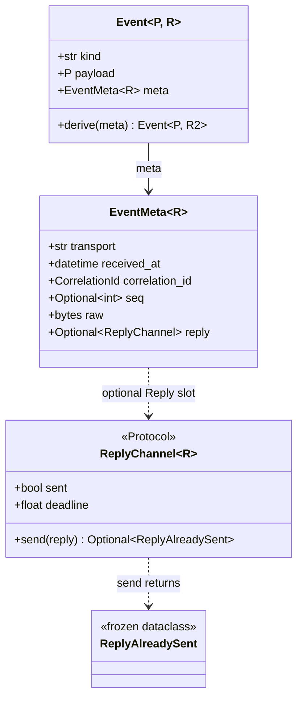
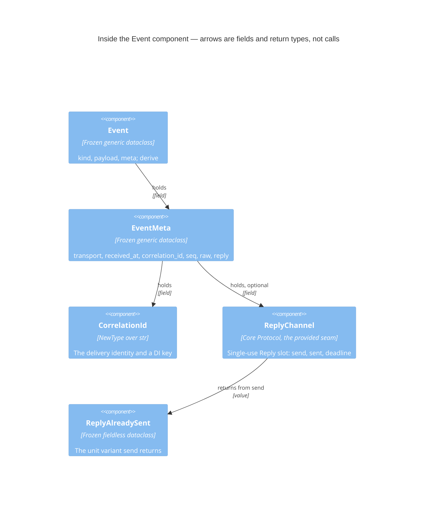
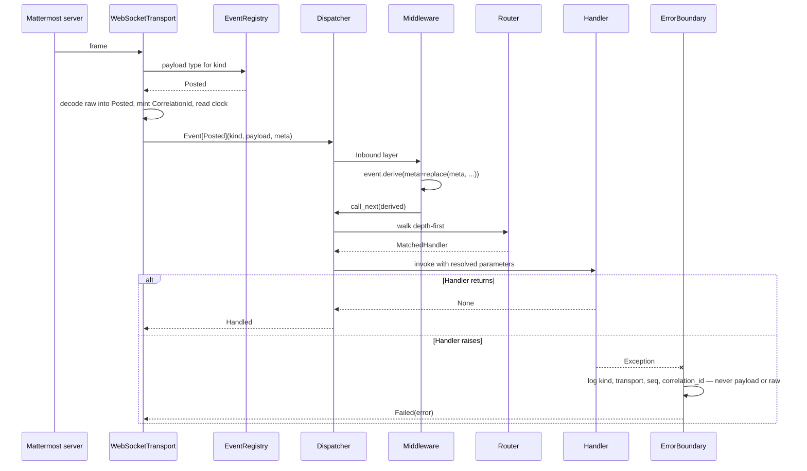
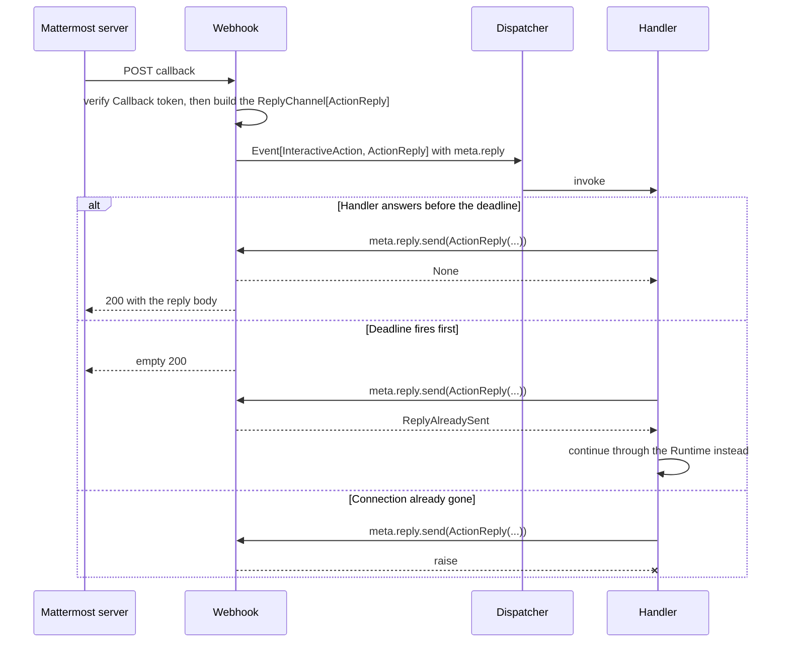
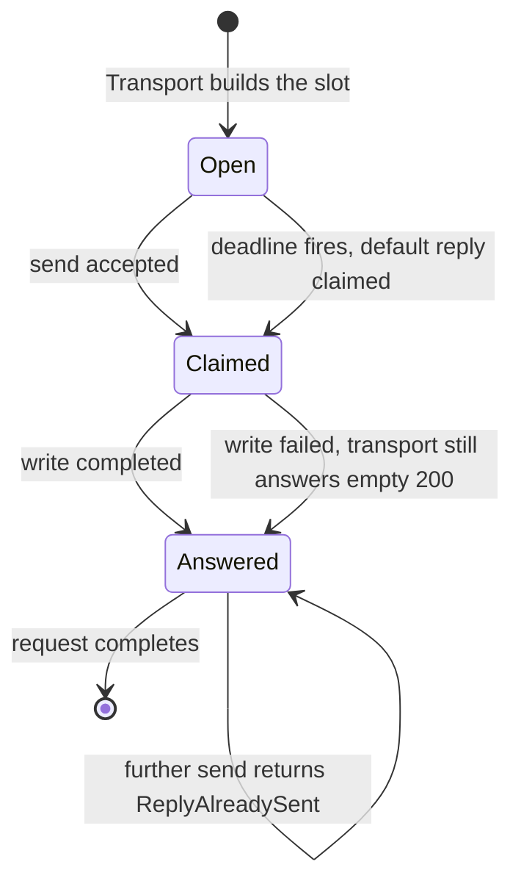

# Event

_Status: reviewed (#86)._
_Layer: Core._
_ADRs: [ADR-0012](../../adr/0012-generic-event-envelope-with-adapter-payloads.md),
[ADR-0019](../../adr/0019-handler-parameter-resolution-rules.md),
[ADR-0020](../../adr/0020-two-layer-middleware-chain.md),
[ADR-0024](../../adr/0024-webhook-ingress-and-callback-security.md),
[ADR-0032](../../adr/0032-layer-model-and-direction-of-allowed-dependencies.md),
[ADR-0034](../../adr/0034-typed-outcomes-for-caller-branches-exceptions-for-broken-contracts.md),
[ADR-0036](../../adr/0036-reply-slot-as-a-second-type-parameter-over-a-core-owned-reply-channel.md),
[ADR-0037](../../adr/0037-derive-is-the-only-enrichment-path-for-an-event.md),
[ADR-0038](../../adr/0038-seam-inventory-records-the-direction-of-the-call.md).
Research: [`docs/research/11`](../../research/11-webhook-ingress-patterns.md),
[`docs/research/19`](../../research/19-provided-and-required-protocol-inventories.md),
[`docs/research/20`](../../research/20-reply-slot-variance-and-capability-typing.md)._

## 1. Purpose and boundaries

Event is the immutable generic envelope every Transport hands to the Core and every other Core
component reads: it carries the platform event name, one typed Payload and the delivery metadata
that routing, middleware, logging and dependency injection all key off. It is the box named *Event*
in [§5.5](../05-building-block-view.md#55-level-3--the-core), and it is the one place where "what
arrived" is separated from "what it means" — the Core knows the envelope and never a concrete
Payload ([ADR-0012](../../adr/0012-generic-event-envelope-with-adapter-payloads.md)). Outside it:
the Payload types and their names, which the Adapter's EventRegistry owns (#69); decoding the wire
into a Payload, which is the Adapter's too; the concrete reply values a webhook callback may send,
which the Webhook document owns (#80); and every decision made *about* an Event — matching,
dispatch, the order of enrichment — which belongs to Filter, Router, Dispatcher and Middleware.

## 2. Responsibilities and non-responsibilities

- Owns: the generic envelope `Event[P, R]` and its single method `derive`; the `EventMeta[R]` record
  and every field in it; the `CorrelationId` type that
  [ADR-0019](../../adr/0019-handler-parameter-resolution-rules.md) makes a built-in injectable key;
  the `ReplyChannel[R]` Protocol that types the Reply slot and the `ReplyAlreadySent` marker its
  `send` returns
  ([ADR-0036](../../adr/0036-reply-slot-as-a-second-type-parameter-over-a-core-owned-reply-channel.md));
  the declared variance of `R`; and the immutability, agreement and single-use invariants those
  types promise the whole Core.
- Does **not** own:
  - the Payload types, their platform names and their decoding — the Adapter's EventRegistry (#69);
  - the reply values `ActionReply` and `DialogReply`, the deadline behaviour, and *when*
    `ReplyAlreadySent` is produced — the Webhook document (#80), whose plugin implements
    `ReplyChannel[ActionReply]` and `ReplyChannel[DialogReply]`
    ([ADR-0024](../../adr/0024-webhook-ingress-and-callback-security.md));
  - minting a `CorrelationId` and filling `EventMeta` — the Transport that received the delivery
    (WebSocketTransport, #81; Webhook, #80);
  - the sequence bookkeeping and replay dedup that `meta.seq` feeds, and the `connection_id` that
    dedup pairs it with — WebSocketTransport (#81);
  - who may derive an enriched envelope and in what order — Middleware (#78)
    ([ADR-0020](../../adr/0020-two-layer-middleware-chain.md));
  - anything injected *beside* the envelope — DependencyProvider (#59);
  - constructing envelopes in tests, and the recording `ReplyChannel` — the Testing toolkit (#25).

## 3. Public contract

Everything below is public; this component has no `_internal` names, because an envelope with a
hidden part would be a value its readers cannot trust.



The three generic types share one declared type parameter; `derive` has one of its own:

```python
P = TypeVar("P")
R = TypeVar("R", contravariant=True, default=Never)  # TypeVar from the compat module
R2 = TypeVar("R2")                                    # used by derive only

class ReplyChannel(Protocol[R]): ...

@final
@dataclass(frozen=True, slots=True, kw_only=True)
class EventMeta(Generic[R]): ...

@final
@dataclass(frozen=True, slots=True, kw_only=True)
class Event(Generic[P, R]):
    kind: str
    payload: P
    meta: EventMeta[R]

    def derive(self, *, meta: EventMeta[R2]) -> Event[P, R2]: ...
```

**`Event[P, R]`** — `@final`, `@dataclass(frozen=True, slots=True, kw_only=True)` (`ST-TYP-05`,
`ST-TYP-08`). `P` is the Payload. `R` is the type the Reply slot accepts, **declared** contravariant
and defaulted to `Never` on the `TypeVar` of the compat module (`ST-TYP-09`) — the one exception to
`ST-TYP-02` that [§9](#9-rules-that-bind-this-component) records. The default lets `Event[Posted]`
stand without a second argument; a callback is written `Event[InteractiveAction, ActionReply]`. The
contravariance makes `Event[InteractiveAction, ActionReply]` assignable where
`Event[InteractiveAction]` is annotated, because `Never` is the bottom type and therefore the top of
the `R` lattice; `ReplyChannel[Never].send` accepts no argument at all, so "this delivery cannot be
answered" is a fact the checker enforces
([ADR-0036](../../adr/0036-reply-slot-as-a-second-type-parameter-over-a-core-owned-reply-channel.md),
[`docs/research/20`](../../research/20-reply-slot-variance-and-capability-typing.md) §1.1). Fields:
`kind: str` — the platform event name verbatim from the wire, kept a plain string because it arrives
as one and the Router keys off annotations rather than off this field
([ADR-0013](../../adr/0013-type-driven-routing-with-a-typed-dispatch-outcome.md)); `payload: P`;
`meta: EventMeta[R]`.

`derive(self, *, meta: EventMeta[R2]) -> Event[P, R2]` is the whole enrichment surface and the only
method on the envelope. It accepts a replacement `EventMeta` and nothing else, so `payload` and
`kind` are unreachable through the public API
([ADR-0037](../../adr/0037-derive-is-the-only-enrichment-path-for-an-event.md)). The result is typed
by the `EventMeta` it receives, because an envelope's `R` is nothing but the `R` of its `meta`: a
Middleware that passes `replace(event.meta, seq=7)` gets `Event[P, R]` back, and one that passes an
`EventMeta[Never]` gets `Event[P, Never]`. `dataclasses.replace`, `copy.replace` and `__replace__`
on an `Event` are banned spellings (`ST-TYP-17`); `dataclasses.replace` on an `EventMeta` is the
intended one.

**`EventMeta[R]`** — `@final`, the same dataclass shape, and a built-in injectable key
([ADR-0019](../../adr/0019-handler-parameter-resolution-rules.md)). Optionality is stated here, not
in the diagram:

| Field | Type | Meaning | Filled by |
|---|---|---|---|
| `transport` | `str` | The `PluginSpec` name of the Transport that delivered this event — a name, never the Transport object, so a Handler cannot reach the transport through its envelope | the Transport |
| `received_at` | `datetime` | Timezone-aware receive time, read from the Transport's injected clock (`ST-TST-09`) | the Transport |
| `correlation_id` | `CorrelationId` | Identifies **one delivery**; never absent | the Transport |
| `seq` | `int \| None` | The transport's own sequence number; `None` for a transport that has none | the Transport |
| `raw` | `bytes` | The undecoded frame as it arrived: opaque to the Core, never logged, never carried by an exception | the Transport |
| `reply` | `ReplyChannel[R] \| None` | The single-use Reply slot, present only for a request/response delivery | the Transport |

`raw` is `bytes` and not a parsed mapping on purpose: a mapping crossing the Core seam would be the
dictionary-as-record of the pattern catalogue (`ST-TYP-12`), and would invite the Core to read
platform structure it is not allowed to know. Re-reading those bytes is the Adapter's business — it
is the same decode that produced the Payload.

**`CorrelationId`** — `NewType('CorrelationId', str)`, so it is a distinct dependency key in a
type-keyed resolver ([ADR-0018](../../adr/0018-core-owned-type-keyed-dependency-injection.md)), no
`str` parameter can accidentally receive one, and it costs nothing at runtime. It is minted per
delivery by the Transport, is the identifier every Core log record carries (`ST-LOG-06`), and is
what a user-visible failure quotes.

**`ReplyChannel[R]`** — the Core-owned Protocol that types `meta.reply`. It is the one **provided**
seam of [§5.4](../05-building-block-view.md#54-the-seams-of-the-core): the Core hands it to a
Handler to call rather than calling out through it
([ADR-0036](../../adr/0036-reply-slot-as-a-second-type-parameter-over-a-core-owned-reply-channel.md),
[ADR-0038](../../adr/0038-seam-inventory-records-the-direction-of-the-call.md)). It has two
implementations: the Webhook plugin's, as `ReplyChannel[ActionReply]` and
`ReplyChannel[DialogReply]` (#80), and the recording slot of the Testing toolkit (#25).

- `async def send(self, reply: R) -> None | ReplyAlreadySent` — accepted at most once. "Already
  answered" is a branch the immediate caller takes in normal operation, so it is a Typed outcome
  (`ST-ERR-01`); a failed write is a broken dependency and raises (`ST-ERR-02`), which gives each
  failure exactly one representation (`ST-ERR-05`).
- `sent: bool` and `deadline: float` — so a Handler can ask before it composes a reply it cannot
  send. The deadline's value, its default of 10 s and what happens when it fires are
  [ADR-0024](../../adr/0024-webhook-ingress-and-callback-security.md)'s and the Webhook document's
  (#80); this Protocol only makes them readable.
- The docstring states the implementer's contract and names its conformance suite (`ST-DOC-03`,
  `ST-TST-02`); see [§10](#10-testing-strategy).

**`ReplyAlreadySent`** — `@final @dataclass(frozen=True, slots=True)` with no fields: the unit
variant of the closed union `None | ReplyAlreadySent` that `send` returns, a Typed outcome and not
an error
([ADR-0034](../../adr/0034-typed-outcomes-for-caller-branches-exceptions-for-broken-contracts.md)).
It is defined here, beside the Protocol whose return annotation names it: with `TYPE_CHECKING`
imports banned ([ADR-0006](../../adr/0006-architectural-tenets-of-the-core.md) tenet 7) that name is
a real import, and the Core imports nothing from an adapter-specific plugin
([ADR-0032](../../adr/0032-layer-model-and-direction-of-allowed-dependencies.md)). The value a seam
names is owned by the layer that owns the seam
([`docs/research/20`](../../research/20-reply-slot-variance-and-capability-typing.md) §2). The
Webhook document (#80) says when the value is produced; it does not define it.

Nothing here is designed to be subclassed: `Event`, `EventMeta` and `ReplyAlreadySent` are `@final`
(`ST-TYP-08`), `CorrelationId` is a `NewType`, and `ReplyChannel` is a Protocol implemented by
composition (`ST-PAT-05`, `ST-PAT-07`).

## 4. Internal structure



| Piece | Responsibility | Why it is separate |
|---|---|---|
| `Event` | Bind one `kind` to one Payload and one metadata record, and be impossible to change | It is the value every other Core component reads; keeping it three fields and one method is what makes "trust what you receive" checkable |
| `EventMeta` | Hold everything true about the *delivery* rather than about the event | It is injected on its own ([ADR-0019](../../adr/0019-handler-parameter-resolution-rules.md)) and it is the unit `derive` replaces wholesale, so the enrichment boundary needs a name |
| `CorrelationId` | Be one delivery's identity, distinguishable from any other string | Type-keyed injection cannot key on `str`, and `ST-LOG-06` needs one name for the field every log line and every user-visible failure carries |
| `ReplyChannel` | Type the Reply slot without the Core knowing a reply value | Its implementations live in an adapter-specific plugin and in the Testing toolkit, and the Core may import neither ([ADR-0032](../../adr/0032-layer-model-and-direction-of-allowed-dependencies.md)); a Protocol needs no import from the implementer |
| `ReplyAlreadySent` | Be the one value `send` returns when the slot is already claimed | A name in a Core return annotation is an import, so the value lives in the layer that owns the Protocol, not in the plugin that produces it |

`EventMeta`, `CorrelationId` and `ReplyAlreadySent` are *parts* in the sense of
[§5.0](../05-building-block-view.md#50-how-to-read-this-section) — named pieces of one reason to
change, the shape of a delivery — and `ReplyChannel` is the seam row of §5.4 that this document
specifies (`ST-SOL-01`, `ST-MOD-09`). The component owns no task, no queue, no timeout and no
logger; every arrow above is a field or a return type, not a call.

## 5. Interactions

### 5.1 A WebSocket delivery reaching a Handler

The main path, and the failure branch that motivates the design: an exception inside the Handler
must reach observability with the envelope's identifiers and none of its content.



The envelope is a value throughout: it is built once, derived zero or more times in the Inbound
layer, and read by Filter, Extractor, Router and the Handler. Nothing in the walk mutates it, which
is why the same envelope may be read by several tasks without a lock
([§8](#8-failure-modes-and-invariants)).

### 5.2 A webhook callback and its Reply slot



Verification runs *before* an Event exists, so a token that fails verification never produces an
envelope; which token outcomes produce a `StaleAction` envelope instead is
[ADR-0024](../../adr/0024-webhook-ingress-and-callback-security.md)'s, described by the Webhook
(#80) and Callback token (#70) documents. The same three branches run against the recording slot of
the Testing toolkit (#25), which is the second implementation of the Protocol and the reason the
conformance suite of [§10](#10-testing-strategy) is parametrised.

### 5.3 The Reply slot's lifecycle

The envelope itself has no states — it is frozen. The one thing it carries that does is the slot,
and these are the states its Protocol makes observable; who drives each transition is the Webhook
document's (#80).



The claim happens before the write, so a cancelled or failed write cannot be followed by a second
accepted `send`. The invariant is *at most one `send` is accepted*, not *at most one is attempted*.

## 6. Design patterns

**[Prototype](https://refactoring.guru/design-patterns/prototype)** — `derive` returns a copy of
this envelope with a replaced `EventMeta`, so a Middleware enriches an immutable value without
knowing how many fields the envelope has or constructing one itself. The problem it solves here is
[ADR-0020](../../adr/0020-two-layer-middleware-chain.md)'s: enrichment on a frozen value, where the
enricher must not be broken by a new metadata field and must not be able to reach the payload.
Rejected: `dataclasses.replace` in the open, which type-checks a payload swap and turns the
invariant into a review note
([ADR-0037](../../adr/0037-derive-is-the-only-enrichment-path-for-an-event.md)); and a mutable
envelope with setters, which [ADR-0006](../../adr/0006-architectural-tenets-of-the-core.md) tenet 5
forbids and which would end the free sharing across tasks.

**[Bridge](https://refactoring.guru/design-patterns/bridge)** (§3.1) — this component supplies the
abstraction half for the Reply slot: `ReplyChannel[R]` is the interface the Handler programmes
against, and the implementation half is the Webhook plugin's two slots and the Testing toolkit's
recording one. Our place in the catalogue row is the Core-owned Protocol, not the two faces the row
names, so `ST-PAT-01` applies in full rather than `ST-PAT-02`. Rejected: a concrete reply object
imported into the Core, which
[ADR-0032](../../adr/0032-layer-model-and-direction-of-allowed-dependencies.md) forbids outright,
and the marker-base variant
[ADR-0036](../../adr/0036-reply-slot-as-a-second-type-parameter-over-a-core-owned-reply-channel.md)
lists.

`ReplyAlreadySent` is no catalogue pattern: it is one unit variant of a closed union, the Typed
outcome of
[ADR-0034](../../adr/0034-typed-outcomes-for-caller-branches-exceptions-for-broken-contracts.md)
(`ST-ERR-01`; under the limits of `ST-PAT-10` a union over existing types is a `type` alias, not a
base). Two catalogue names were considered for it and rejected
([`docs/research/20`](../../research/20-reply-slot-variance-and-capability-typing.md) §2):

- **[Introduce Null Object](https://refactoring.guru/introduce-null-object)** (§3.1, a refactoring)
  — a `NoReplyChannel` that discards sends, so every Handler could call `send` unconditionally.
  Rejected: a Null Object is a do-nothing implementation that *removes* a branch, whereas
  `ReplyAlreadySent` exists to *create* one, and `R = Never` already makes the checker force the
  branch a WebSocket delivery needs.
- **[Command](https://refactoring.guru/design-patterns/command)** (§3.1) — a reply as a command
  object whose execution reports whether it ran. Rejected: Command encapsulates an operation as an
  object and says nothing about a typed return value; the branch the Handler takes on the result is
  the whole point here.

Considered and unused (`ST-PAT-09`):

- **[Builder](https://refactoring.guru/design-patterns/builder)** (§3.1) — an `EventBuilder` for
  Transports. Rejected: `kw_only=True` construction already names every field at the call site, and
  a half-built envelope is exactly what [§8](#8-failure-modes-and-invariants) forbids. Convenience
  construction for tests is the Testing toolkit's event builders (#25).
- **[Decorator](https://refactoring.guru/design-patterns/decorator)** (§3.1) — wrapping an envelope
  to add fields. Rejected: a wrapper is not the frozen dataclass the seam promises, and enrichment
  already has one path.
- **[Memento](https://refactoring.guru/design-patterns/memento)** (§3.2, restricted) — snapshotting
  an envelope for replay. Rejected: the envelope is already immutable, so a snapshot would be a
  second name for the same value; replay is `meta.raw` decoded again by the Adapter.
- **[Visitor](https://refactoring.guru/design-patterns/visitor)** — double dispatch over payload
  kinds. Rejected: subscription is by annotation
  ([ADR-0013](../../adr/0013-type-driven-routing-with-a-typed-dispatch-outcome.md)), so there is no
  traversal to double-dispatch, and a Visitor would put payload knowledge in the Core.
- **[Flyweight](https://refactoring.guru/design-patterns/flyweight)** — sharing envelopes. Rejected:
  an envelope lives for one dispatch and pooling it would keep `raw` alive far longer than the
  retention this document promises.
- **[Strategy](https://refactoring.guru/design-patterns/strategy)** (§3.1) — nothing inside the
  envelope varies independently of it; the strategies of the dispatch path belong to Filter (#64)
  and WebSocketTransport (#81).

No banned pattern appears: there is no dictionary-as-record (`raw` is opaque bytes, not a bag), no
module-level state, no ambient context, no attribute stashed on a foreign object (`ST-TYP-16`), and
no `replace` on an `Event` (`ST-TYP-17`).

## 7. SOLID analysis

**S.** The component has one reason to change: the shape of a delivery. `EventMeta`,
`CorrelationId`, `ReplyChannel` and `ReplyAlreadySent` are pieces of that one reason and not four
more — a delivery has metadata, an identity and, sometimes, a way back that may already be taken —
which is the *part* distinction [§5.0](../05-building-block-view.md#50-how-to-read-this-section)
draws and `ST-SOL-01` permits. The things that would be second reasons are all elsewhere: decoding
is the Adapter's, matching is the Router's, enrichment order is the Middleware's.

**O.** A new event kind, a new payload type and a new reply value are all added without editing
anything here: the kind is a string, the payload is `P`, and the reply is `R` behind a Protocol.
That is `ST-SOL-02`'s own example read from the other side — the Core must never grow `if
isinstance(event.payload, …)`, and it cannot, because it has no name to write on the right of the
`isinstance`. A third type parameter, should one be needed, is appended after `R` with its own
default and declared variance, and every existing annotation stands
([`docs/research/20`](../../research/20-reply-slot-variance-and-capability-typing.md) §3).

**L.** `Event` and `EventMeta` are `@final`, so substitutability is a question about
`ReplyChannel[R]` and about the variance of `R`. The first is answered by mechanism: every
implementation passes the same conformance suite unchanged (`ST-SOL-03`), parametrised over the
Webhook slot and the recording slot. The second is answered by declaration, not inference: `R` is
declared contravariant, so an `Event[InteractiveAction, ActionReply]` is accepted where
`Event[InteractiveAction]` is annotated and a Handler that ignores the slot is correct, not merely
tolerated. The declaration is truthful — a frozen dataclass raises on assignment, so at runtime `R`
appears only in output positions, and the one synthesised input position, `__replace__`, is banned
(`ST-TYP-17`) — and it is the only spelling all four checkers accept: inference is unavailable on
the 3.12 floor, and on 3.13 that same `__replace__` makes pyright and ty infer a frozen field
invariant ([`docs/research/20`](../../research/20-reply-slot-variance-and-capability-typing.md) §1).
`derive` names `R` in no parameter — its `meta` is an `EventMeta[R2]` — so it constrains nothing
about `R`. `ReplyChannel[Never]` has no callable `send`, which is how "this delivery cannot be
answered" becomes a type fact.

**I.** `ReplyChannel` is sized to its single consumer, the Handler: `send`, `sent`, `deadline`
(`ST-SOL-04`). It is deliberately not merged with the `Transport` seam, although the Webhook
implements both — two Protocols on one class is normal and costs nothing, while one wide Protocol
would force `websockets`-side implementations to carry a `send` nobody can call.

**D.** The Core owns the Protocol and the marker its return annotation names, and imports no
implementation of either; the Webhook plugin, one rank above, implements the Protocol and imports
the marker, so every import runs towards the Core
([ADR-0032](../../adr/0032-layer-model-and-direction-of-allowed-dependencies.md), `ST-SOL-05`,
`ST-MOD-05`). This component imports the standard library and the compat module and nothing else,
which is the `forbidden` contract of the Core taken literally.

## 8. Failure modes and invariants

Invariants that must always hold:

1. An envelope never changes after construction. `derive` is the only producer of a related envelope
   and it replaces `meta` only
   ([ADR-0037](../../adr/0037-derive-is-the-only-enrichment-path-for-an-event.md)).
2. `kind` and `payload` agree, by construction: the Transport builds them from one decode and the
   Core never re-derives one from the other.
3. `correlation_id` is present on every envelope and identifies **one delivery**, not one platform
   fact. A redelivery that dedup did not catch is a second envelope with a second id, so the
   idempotency of a business effect keys off a platform identifier — compare-and-set
   ([ADR-0022](../../adr/0022-state-plugin-model.md)) or a Callback token's `jti`
   ([ADR-0024](../../adr/0024-webhook-ingress-and-callback-security.md)) — and the guarantee
   `ST-ASY-09` gives a threaded Handler is per delivery.
4. `raw` is opaque: the Core never parses it, never logs it and never embeds it in an exception.
5. At most one `send` on a Reply slot is ever accepted, and the claim precedes the write.

| Failure mode | What happens | Typed outcome or exception | Which boundary converts it |
|---|---|---|---|
| Bad input — a `kind` with no registered payload | Not a failure here: the Adapter decodes it to `RawEvent`, so invariant 2 still holds and the event stays routable ([ADR-0012](../../adr/0012-generic-event-envelope-with-adapter-payloads.md)) | neither | — |
| Bad input — a frame that does not decode | No envelope is ever constructed; the Adapter's decode raises before this component is reached | exception | the Transport, which logs and drops the frame; it never becomes a dispatch |
| Bad input — a malformed envelope (a missing field, a `str` where a `CorrelationId` is due) | Unconstructible: keyword-only frozen construction plus four strict checkers reject it, and every construction site is first-party. Timezone-awareness of `received_at` is the promise of the Transport's injected clock (`ST-TST-09`) and is not checked here. This component performs **no runtime validation**, deliberately: it is the per-event hot path, and a hand-built envelope's checking belongs to the Testing toolkit's event builders (#25) | neither | — |
| Timeout | The envelope owns no I/O and no deadline of its own. The one deadline it carries is the slot's: when it fires the Transport claims the slot and answers, and a later `send` reports `ReplyAlreadySent` | typed outcome | none — the Handler is the immediate caller and must branch (`ST-ERR-01`) |
| Cancellation | An envelope is a value, so a cancelled dispatch simply drops it. `send` is the only awaitable in the contract; `CancelledError` passes through untouched (`ST-ASY-04`) and the claim already made is not released, so no second reply can follow | exception (`CancelledError`, unhandled by design) | none — `BaseException` passes the ErrorBoundary ([ADR-0021](../../adr/0021-core-error-boundary.md)) |
| Dependency outage — the HTTP connection behind a slot is gone | `send` raises; the Protocol permits it and says so, because a failed write is a broken dependency and not a branch the caller can usefully take | exception | the ErrorBoundary, into `Failed` ([ADR-0021](../../adr/0021-core-error-boundary.md)) |
| Concurrent use — several tasks read one envelope | Nothing: it is frozen, so it is shared without a lock, which is also what keeps it correct on the free-threaded build ([ADR-0008](../../adr/0008-python-floor-3-12-with-typing-extensions.md)) | neither | — |
| Concurrent use — two tasks race `send` | Exactly one claim succeeds; that caller receives `None`, the other `ReplyAlreadySent` | typed outcome | none |

**Logging.** This component writes no log line — it has no logger, and `ST-LOG-01` therefore has
nothing to bind here. It is the *source* of what others log. Loggable from an envelope: `kind`,
`transport`, `seq`, `correlation_id`, `received_at`, and at most the length or a digest of `raw`.
Never loggable: `payload` in whole or in part, `raw` itself, and anything reachable through the
Reply slot (`ST-LOG-02`). No switch turns any of that on (`ST-LOG-03`); `payload` and `raw` are
named in the single redaction list `ST-LOG-04` requires, whose final contents are #29's.
`correlation_id` is the identifier `ST-LOG-06` requires a user-visible failure to carry, which is
why it is non-optional.

**Observability.** The component emits nothing. `kind`, `transport` and `correlation_id` are the
attributes every span and metric of a dispatch carries, and the Observability seam through which the
Dispatcher reports an `Unhandled` walk
([ADR-0013](../../adr/0013-type-driven-routing-with-a-typed-dispatch-outcome.md)) carries the event
name and never its content.

## 9. Rules that bind this component

The identifiers are those of [`engineering-style.md`](../engineering-style.md) §12.1; each line says
only how the rule lands here.

- **Design.** `ST-SOL-01` — one reason to change, the shape of a delivery, with three parts and one
  seam. `ST-SOL-02` — a new kind, payload or reply value touches nothing here. `ST-SOL-03` — the
  `ReplyChannel` suite runs unchanged against both implementations. `ST-SOL-04` — `ReplyChannel` has
  three members for one consumer. `ST-SOL-05` — the Webhook implements a Protocol this layer owns.
  `ST-PAT-01`, `ST-PAT-02`, `ST-PAT-09` — Prototype and Bridge named with their rejected
  alternatives, eight patterns declined in [§6](#6-design-patterns). `ST-PAT-05`, `ST-PAT-07` —
  `ReplyChannel` is a Protocol realised by composition, never subclassed. `ST-PAT-10` — the union
  `send` returns is a `type` alias over existing types, so no base class exists.
- **Typing.** `ST-TYP-02` — **permanent exception** for exactly `Event`, `EventMeta` and
  `ReplyChannel`: they are written `Generic[P, R]`, `Generic[R]` and `Protocol[R]` over a
  `TypeVar("R", contravariant=True, default=Never)` from the compat module, because inference makes
  `R` invariant under three of four checkers, the `= Never` default and inference are unavailable on
  the 3.12 floor, and on 3.13 the dataclass `__replace__` makes pyright and ty infer a frozen field
  invariant ([`docs/research/20`](../../research/20-reply-slot-variance-and-capability-typing.md)
  §1). No other type in this component is exempt. `ST-TYP-09` — that `TypeVar` and `Never`'s default
  come through the compat module. `ST-TYP-05`, `ST-TYP-08` — `Event`, `EventMeta` and
  `ReplyAlreadySent` are frozen, slotted, keyword-only and `@final`. `ST-TYP-06` — `ReplyChannel` is
  a Protocol and its limits apply. `ST-TYP-03`, `ST-TYP-04`, `ST-TYP-11`, `ST-TYP-12` — the contract
  has no open value; `raw: bytes` is opaque, not open. `ST-TYP-13` — the tests of
  [§10](#10-testing-strategy). `ST-TYP-16` — anything a Middleware wants a Handler to see is a
  derived envelope or an Event-scope value, never an attribute on this one. `ST-TYP-17` — `derive`
  is the only enrichment path; the ban covers `dataclasses.replace`, `copy.replace` and
  `__replace__` on an `Event`.
- **Async.** `ST-ASY-04` — `send` lets `CancelledError` pass and keeps the claim. `ST-ASY-11` —
  `send` is `async` because the Protocol says so; the recording slot awaits nothing and is still a
  coroutine function. `ST-ASY-01`, `ST-ASY-02`, `ST-ASY-03`, `ST-ASY-05` — nothing to bind: the
  component owns no task, queue or timeout; the reply deadline is the Webhook's (#80).
- **Errors.** `ST-ERR-01` — `ReplyAlreadySent` is the Typed outcome of `send`. `ST-ERR-02` — a
  failed write raises. `ST-ERR-05` — one representation per failure; the two never overlap.
  `ST-ERR-08` — an exception raised from `send` may carry `correlation_id`, never `raw` or
  `payload`.
- **Naming and layout.** `ST-NAM-01` — `Event`, `EventMeta`, `CorrelationId`, `ReplyChannel` and
  `ReplyAlreadySent` are the glossary spellings. `ST-NAM-05` — nothing to bind: no synchronous face
  receives events
  ([ADR-0029](../../adr/0029-synchronous-face-from-a-sans-io-core-with-thin-drivers.md)).
  `ST-NAM-08` — `P`, `R` and `R2` stay one letter; position makes the roles obvious. `ST-MOD-01`,
  `ST-MOD-03` — all five names are public and re-exported. `ST-MOD-05` — imports: standard library
  and compat module only. `ST-MOD-09` — one module for the component and its three parts.
- **Logging.** `ST-LOG-01` — nothing to bind: no logger. `ST-LOG-02`, `ST-LOG-03`, `ST-LOG-04`,
  `ST-LOG-06` — as [§8](#8-failure-modes-and-invariants) applies them: identifiers loggable,
  `payload` and `raw` on the redaction list, `correlation_id` on every user-visible failure.
- **Documentation.** `ST-DOC-01`, `ST-DOC-02` — every public name has a docstring with a doctest.
  `ST-DOC-03` — `ReplyChannel`'s docstring names its conformance suite. `ST-DOC-04` — the comment on
  the `TypeVar` declaration cites
  [ADR-0036](../../adr/0036-reply-slot-as-a-second-type-parameter-over-a-core-owned-reply-channel.md)
  and [`docs/research/20`](../../research/20-reply-slot-variance-and-capability-typing.md).
  `ST-DOC-06` — the five public names record the release they appear in.

## 10. Testing strategy

- **Unit.** Frozen construction is keyword-only and assignment raises; `derive` returns a new
  envelope whose `kind` and `payload` are the *same objects* and whose `meta` is the replacement;
  `CorrelationId` is accepted where a `CorrelationId` is asked for and a bare `str` is not.
- **Contract.** A `ReplyChannel` conformance suite in `aiommbot.testing` (#25), parametrised over
  every implementation rather than copied per implementation (`ST-TST-08`, `ST-SOL-03`,
  `ST-TST-02`): a first `send` is accepted; a second reports `ReplyAlreadySent`; `sent` and
  `deadline` are readable before and after; two concurrent `send` calls produce exactly one
  acceptance; a cancelled `send` leaves the slot claimed and un-resendable; a broken connection
  raises rather than returning an outcome. It runs against the Webhook slot and the recording slot.
- **Integration.** An envelope built by the in-memory `WebSocketConnection` connector and one built
  by `handle_callback` each reach a Handler with `meta` fully populated. Our own Protocols are
  doubled with the Testing toolkit or a real implementation (`ST-TST-01`), and the doubles report by
  returning typed data (`ST-TST-07`).
- **Property-based.** The invariants are compact enough to generate against: for any envelope and
  any `EventMeta`, `derive(meta=m).payload is e.payload` and `derive` never changes `kind`; and for
  any frame the Adapter decodes, re-decoding `meta.raw` yields an equal Payload.
- **Typing tests** (`tests/typing/`, `ST-TYP-13`) — the six checks of
  [`docs/research/20`](../../research/20-reply-slot-variance-and-capability-typing.md) §1.2, run
  under mypy, pyright, pyrefly and ty, each in `--python-version 3.12` and `3.13` mode, with no
  suppression outside the negative cases. With `e_slot: Event[InteractiveAction, ActionReply]`,
  `e_plain: Event[InteractiveAction]` and `e_posted: Event[Posted]`:

  | # | Check | Expected |
  |---|---|---|
  | T1 | `widened: Event[InteractiveAction] = e_slot` | accepted |
  | T2 | `narrowed: Event[InteractiveAction, ActionReply] = e_plain` | rejected |
  | T3 | `await handler(e_slot)` with `handler(event: Event[InteractiveAction])` | accepted |
  | T3b | `await slot_handler(e_plain)` with `slot_handler(event: Event[InteractiveAction, ActionReply])` | rejected |
  | T4 | `assert_type(e_slot.derive(meta=replace(e_slot.meta, seq=7)), Event[InteractiveAction, ActionReply])` | accepted |
  | T4b | `e_slot.derive(payload=…)`, `e_slot.derive(kind=…)` | rejected |
  | T4c | `assert_type(e_slot.derive(meta=m_never), Event[InteractiveAction, Never])` with `m_never: EventMeta[Never]` | accepted |
  | T5 | `await e_slot.meta.reply.send(ActionReply())` / `.send(DialogReply())` | accepted / rejected |
  | T6 | `assert_type(e_posted.meta.reply, ReplyChannel[Never] \| None)`; `.send(ActionReply())` | accepted; rejected |

  A cell passes when exactly the expected diagnostics appear, so a spurious report from any checker
  on the constructor call inside `derive` fails the suite rather than being suppressed
  (`ST-TYP-14`). `assert_type(event.payload, Posted)` for an `Event[Posted]` completes the set.
- **Failure modes.** One test per row of [§8](#8-failure-modes-and-invariants) (`ST-TST-04`), each
  asserting one behaviour and named after it (`ST-TST-03`).
- **Time.** `received_at` comes from an injected clock and the reply deadline is driven forward
  (`ST-TST-09`). Nothing here raises a warning (`ST-TST-06`).
- **Coverage.** `ST-TST-05` is cheap here, because the component has almost no branches: `derive`,
  and the slot's claim.

## 11. Open questions

| Question | Ticket |
|---|---|
| The home, shape and fixtures of the `ReplyChannel` conformance suite, the recording slot, and the event builders a hand-built envelope is validated by | #25 (Testing toolkit) |
| The final contents of the single redaction list that must name `payload` and `raw`, and the observer record that carries `correlation_id` | #29 (observability boundary) |
| Whether the `RawEvent` payload re-decodes `meta.raw` or receives the parsed mapping from the Adapter's own decode | #69 (EventRegistry) |
