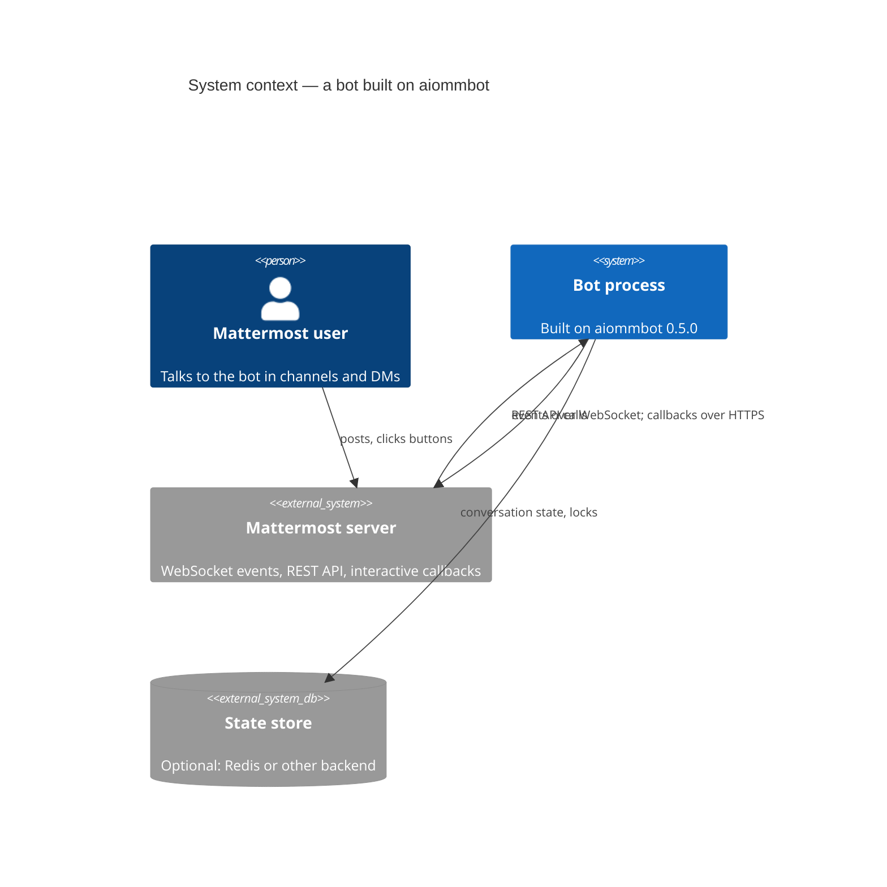

# Diagram conventions

_Status: reviewed (#35)._

All diagrams are **Mermaid** blocks inside Markdown. They render on GitHub and in the docs site,
are reviewed in pull requests and are diffed like code. No images, no binary diagram files.

## Levels (C4 model)

| Level | Used in | Mermaid syntax | Shows |
|---|---|---|---|
| System Context | `03-context-and-scope.md` | `C4Context` | the bot, its users, Mattermost, storage, operators |
| Container | `05-building-block-view.md` | `C4Container` | runnable units and stores in a deployment |
| Layers | `05-building-block-view.md` §5.3 | `C4Component` | the five layers of a process as boxes; arrows are the import direction |
| Component | `05-building-block-view.md`, each `components/*.md` | `C4Component` | the modules inside a container and their dependencies |
| Code | `components/*.md` when it helps | `classDiagram` | Protocols, key classes, generics |
| Dynamic | `06-runtime-view.md`, `components/*.md` | `sequenceDiagram` | one scenario end to end |
| State | `components/*.md` for stateful nodes | `stateDiagram-v2` | lifecycle and FSM states |

## Rules

- One diagram, one question. If a diagram needs a legend longer than three lines, split it.
- Names in diagrams are the `CONTEXT.md` terms, exactly.
- Every box on a Component diagram has a row in the inventory table directly under the diagram,
  and that row links to the box's document (Mermaid's C4 boxes carry no reliable link on GitHub).
  Every arrow is labelled with the verb and, for async paths, the mechanism (`await`, `queue`,
  `task`).
- Arrows are imports: an arrow from A to B means A may import B, so every arrow points towards the
  Core and none leaves it. A diagram that contradicts the import-linter contracts is a bug in one
  of them.
- Sequence diagrams show failure paths (`alt`/`else`) for the scenarios that motivate the design:
  reconnect, timeout, cancellation, storage unavailable.

## Renderer limits

- A `classDiagram` member containing `|` or `(…)` is parsed as a method; write `Optional~T~ name`
  and state optionality in the table instead.
- `Container_Boundary` does not render inside `C4Component`.
- C4 boxes carry no reliable hyperlink on GitHub; the inventory table holds the link.

## Example

