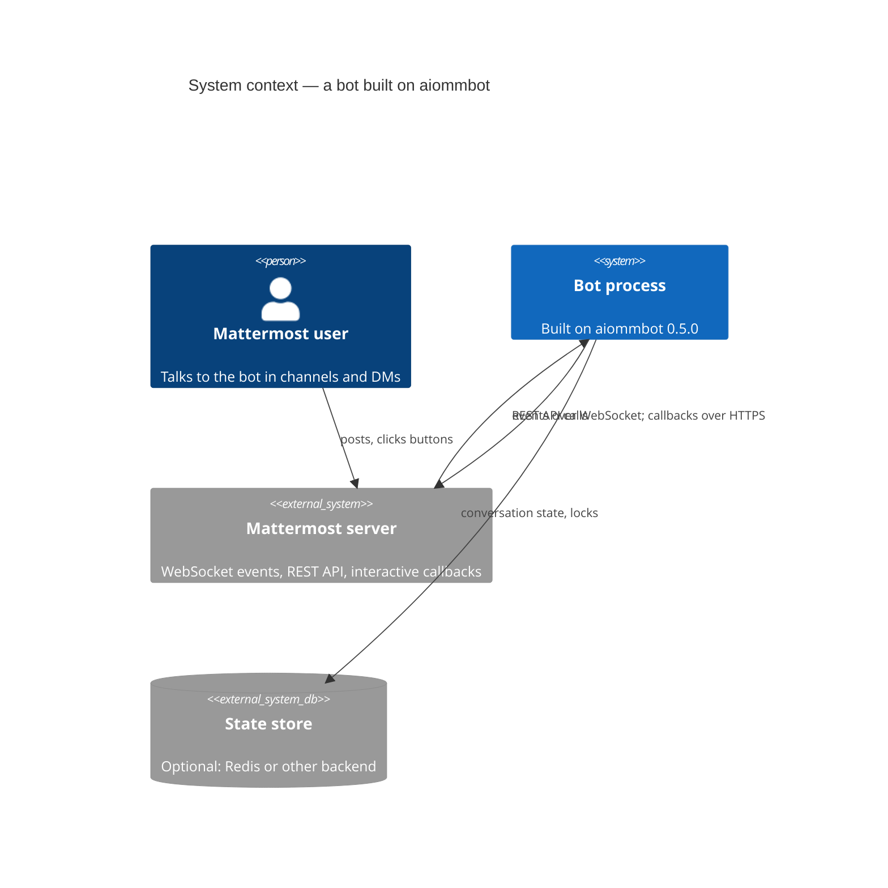

# Diagram conventions

_Status: reviewed (#35)._

All diagrams are **Mermaid** blocks inside Markdown. They render on GitHub and in the docs site,
are reviewed in pull requests and are diffed like code. No images, no binary diagram files.

## Levels (C4 model)

| Level | Used in | Mermaid syntax | Shows |
|---|---|---|---|
| System Context | `03-context-and-scope.md` | `C4Context` | the bot, its users, Mattermost, storage, operators |
| Container | `05-building-block-view.md` | `C4Container` | runnable units and stores in a deployment |
| Layers | `05-building-block-view.md` §5.3 | `C4Component` | the five layers of a process as boxes; arrows are the import direction |
| Component | `05-building-block-view.md`, each `components/*.md` | `C4Component` | the modules inside a container and their dependencies |
| Code | `components/*.md` when it helps | `classDiagram` | Protocols, key classes, generics |
| Deployment | `07-deployment-view.md` | `C4Deployment` | infrastructure nodes and which processes run on them |
| Dynamic | `06-runtime-view.md`, `components/*.md` | `sequenceDiagram` | one scenario end to end |
| State | `components/*.md` for stateful nodes | `stateDiagram-v2` | lifecycle and FSM states |

## Rules

- One diagram, one question. If a diagram needs a legend longer than three lines, split it.
- Names in diagrams are the `CONTEXT.md` terms, exactly.
- Every box on a Component diagram has a row in the inventory table directly under the diagram,
  and that row links to the box's document (Mermaid's C4 boxes carry no reliable link on GitHub).
  Every arrow is labelled with the verb and, for async paths, the mechanism (`await`, `queue`,
  `task`).
- Arrows are imports **on a Component or Layers diagram**: an arrow from A to B means A may import
  B, so every arrow points towards the Core and none leaves it. A diagram that contradicts the
  import-linter contracts is a bug in one of them.
- Arrows are traffic on a Context, Container or Deployment diagram, and the label names the
  protocol. A Deployment diagram nests `Deployment_Node` for infrastructure and puts a `Container`
  inside the node that runs it; it shows no module and repeats no import direction.
- A sequence diagram draws the failure branch that motivated the design as one `alt`/`else`, and
  carries every other outcome in a branch table beneath it
  ([ADR-0067](../adr/0067-a-runtime-scenario-is-one-order-between-boxes.md)).

## Renderer limits

### Class and C4 diagrams

- A `classDiagram` member containing `|` or `(…)` is parsed as a method; write `Optional~T~ name`
  and state optionality in the table instead.
- `Container_Boundary` does not render inside `C4Component`.
- C4 boxes carry no reliable hyperlink on GitHub; the inventory table holds the link.
- Mermaid carries a standing caveat on all five C4 diagram types — "This is an experimental diagram
  for now. The syntax and properties can change in future releases"
  ([mermaid.js.org/syntax/c4](https://mermaid.js.org/syntax/c4.html)) — so a C4 block stays inside
  the shapes already used in this catalogue and adopts no property a section does not need.

### Sequence diagrams

Measured against the grammar and the renderer GitHub serves in
[`.agents/research/38`](../../.agents/research/38-mermaid-sequence-diagram-limits.md), which carries
the evidence for every line below and six further limits this catalogue does not reach.

- Declare every participant with an explicit `participant` line, in reading order, and give it a
  short `as` label. Declaration order is the only control over column order, and the `as` label is
  the only way to get a space, a comma or a reserved word into a visible name — without it the
  longest-match lexer folds the alias into the id.
- Keep every participant id clear of the 34 reserved words. They bite in any case, so `End`, `NOTE`
  and `Alt` are the same tokens as their lower-case spellings; an id that merely *begins* with one
  is safe. Case is not a defence and no case convention is required.
- Write `activate` and `deactivate` as statements rather than the `-` shorthand: `A-->>-xStore: get`
  lexes `-x` as the cross arrow and fails to parse.
- Keep `#` and `;` out of every label — `#` opens a comment and `;` ends the statement — which also
  rules out hex colours anywhere in the block.
- Label every arrow, and keep the label short enough to read at column width. An empty label breaks
  the diagram when it is the last statement, and nothing wraps at the default configuration: a long
  label pushes the lifelines apart until GitHub scales the whole figure down.
- Break a long label yourself with ` `, never ` `, which the renderer's regex does not
  match.
- Nest `alt`, `opt`, `loop`, `par`, `critical`, `break` and `rect` at most two deep. The grammar
  imposes no limit; the reader does, and the open renderer defects in the nested case are all about
  labels and activation boxes inside branches.
- Use no construct newer than mermaid `11.15.0` and none the sequence page does not document.
  `11.15.0` is the measured ceiling — every construct available at it parses on GitHub today — and
  the catalogue takes no margin below it, because an undocumented construct is the first thing a
  parser rewrite drops and two of them emit tags GitHub's sanitiser strips.
- Put no `link` in the figure: at GitHub's configuration the popup it draws is unreachable, and a
  reader looks for a URL in the prose or the table beside the diagram, as they already do for a C4
  box.

## Example

